# Bilibili 视频获取及评论弹幕分析

## 视频获取

在bilibili上我们可以观看错位时空，链接`https://www.bilibili.com/video/BV14z4y1S7s2/`

通过搜寻查找到了选集的json数据，根据其网址`https://api.bilibili.com/x/player/pagelist?bvid=BV14z4y1S7s2&jsonp=jsonp`进行request请求

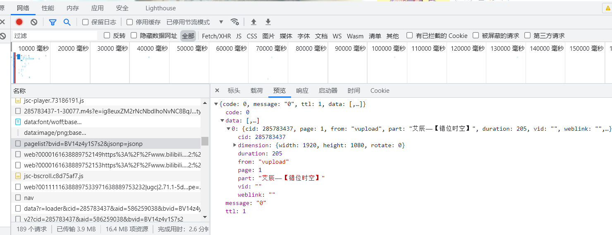

```json
{code: 0, message: "0", ttl: 1, data: [,…]}
    code: 0
    data: [,…]
        0: {cid: 285783437, page: 1, from: "vupload", part: "艾辰——【错位时空】", duration: 205, vid: "", weblink: "",…}
            cid: 285783437
            dimension: {width: 1920, height: 1080, rotate: 0}
            duration: 205
            from: "vupload"
            page: 1
            part: "艾辰——【错位时空】"
            vid: ""
            weblink: ""
    message: "0"
    ttl: 1
```

根据其结构，是嵌套的字典，通过字典的键取值，如下部分是采集部分，分别解析出name,cid。

```python
def get_cid_name(bvid):
    url = 'https://api.bilibili.com/x/player/pagelist?'
    param = {
        'bvid': bvid,
        'jsonp': 'jsonp'
    }
    response = requests.get(url=url, params=param, headers=headers).json()
    data = response['data'][0]

    cid = data['cid']
    name = data['part']
    return cid, namedata = response['data'][0]

cid = data['cid']
name = data['part']
```

### 音视频链接搜寻

,通过多次刷新，找到了音视频的真实链接，由下图此我们可以看出，想要获取视频链接就要先得到bvid,cid,session三个值，以及一些其它固定的参数。cid、bvid已经获得，session则在视频html页面中直接存在，通过正则表达式即可获取`session = re.findall('"session":"(.*?)"',response.text)[0]`

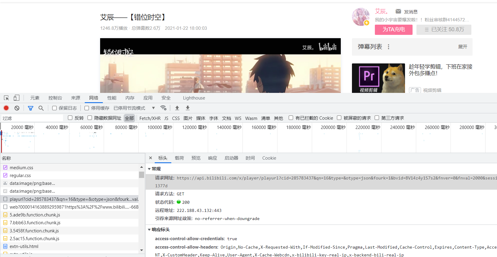

请求时，应附带上如下参数

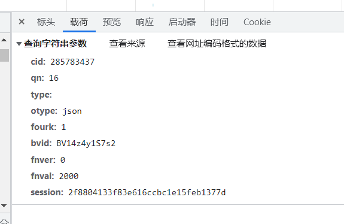

其返回的也是一个json结构，通过5层字典解析，可以得到真正的链接

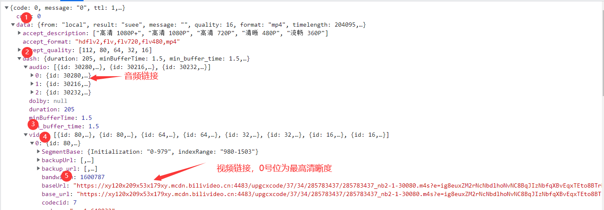

```python
def get_video_url(bvid, cid, session):
    url = 'https://api.bilibili.com/x/player/playurl'
    params = {
        'cid': cid,
        'bvid': bvid,
        'qn': '0',
        'type': '',
        'otype': 'json',
        'fourk': '1',
        'fnver': '0',
        'fnval': '976',
        'session': session
    }
    response = requests.get(url=url, params=params, headers=headers).json()
    # json解析，五层字典取出实际url
    audio_url = response['data']['dash']['audio'][0]['baseUrl']
    video_url = response['data']['dash']['video'][0]['baseUrl']
    print("音视频链接已得到" + "音频：" + audio_url + "视频：" + video_url)
    return audio_url, video_url
```

### 文件保存

此类音视频文件需要以二进制形式解析存储，在request时便需要以`.content`形式接收，保存时使用常规的文件保存方式即可，只需将后缀名改成对应的`.mp3 .mp4`。

```
def save_video(name, audio_url, video_url):
    """保存数据 r.content获取二进制内容"""
    # 请求音频数据，返回的数据二进制形式解析
    audio_content = get_response(audio_url).content
    print("开始下载" + name + "音频")
    # 保存音频文件
    with open(f"{name}.mp3", mode='wb') as af:
        af.write(audio_content)
        print(name + "音频保存完成")

    # 请求视频数据，返回的数据二进制形式解析
    video_content = get_response(video_url).content
    print("开始下载" + name + "视频")
    # 保存视频文件
    with open(f"{name}.mp4", mode='wb') as vf:
        vf.write(video_content)
        print(name + "视频保存完成")
```

### 音视频合并

得到的音视频文件还需要合并才能成为一个完整的视频，否则手动对齐有点困难，这里使用的是`ffmpeg`,下载链接`https://github.com/BtbN/FFmpeg-Builds/releases`，下载后解压，将其下的bin目录添加到系统环境变量path中，可以在cmd中输入`ffmpeg -version`来检查是否添加成功，这样当我们使用命令时系统便可以识别`ffmpeg`并执行命令。

进行合并时，可以在本路径打开cmd输入命令合并

```bash
ffmpeg -i 艾辰——【错位时空】.mp4 -i 艾辰——【错位时空】.mp3 -acodec copy -vcodec copy A艾辰——【错位时空】.mp4
```

但既然我们已经使用了python，就贯彻到底，导包`subprocess`，调用cmd命令

```python
def merge_audio_video(name):
    """音视频合并"""
    # cmd 命令
    command = f"ffmpeg.exe -i {name}.mp4 -i {name}.mp3 -acodec copy -vcodec copy A{name}.mp4"
    subprocess.run(command, shell=True)
    print(name + "视频正在执行合成命令")
```

至此，一个bilibili视频下载程序就完成了

### 完整程序

```python
import pprint
import re
import subprocess
import requests

headers = {
    # 浏览器标识符
    'user-agent': 'Mozilla/5.0 (Windows NT 10.0; Win64; x64) AppleWebKit/537.36 (KHTML, like Gecko) '
                  'Chrome/96.0.4664.45 Safari/537.36',
    # 防盗链
    'referer': 'https://www.bilibili.com/video/'
}


def get_response(url):
    """发送请求"""
    response = requests.get(url=url, headers=headers)
    return response


def get_cid_name(bvid):
    url = 'https://api.bilibili.com/x/player/pagelist?'
    param = {
        'bvid': bvid,
        'jsonp': 'jsonp'
    }
    response = requests.get(url=url, params=param, headers=headers).json()
    data = response['data'][0]

    cid = data['cid']
    name = data['part']
    return cid, name


def get_session(bvid):
    """request请求后 正则表达式session"""
    url = f'https://www.bilibili.com/video/{bvid}'
    response = requests.get(url=url, headers=headers)
    # 使用正则表达式进行获取
    session = re.findall('"session":"(.*?)"', response.text)[0]
    return session


def get_video_url(bvid, cid, session):
    url = 'https://api.bilibili.com/x/player/playurl'
    params = {
        'cid': cid,
        'bvid': bvid,
        'qn': '0',
        'type': '',
        'otype': 'json',
        'fourk': '1',
        'fnver': '0',
        'fnval': '976',
        'session': session
    }
    response = requests.get(url=url, params=params, headers=headers).json()
    # json解析，五层字典取出实际url
    audio_url = response['data']['dash']['audio'][0]['baseUrl']
    video_url = response['data']['dash']['video'][0]['baseUrl']
    print("音视频链接已得到" + "音频：" + audio_url + "视频：" + video_url)
    return audio_url, video_url


def save_video(name, audio_url, video_url):
    """保存数据 r.content获取二进制内容"""
    # 请求音频数据，返回的数据二进制形式解析
    audio_content = get_response(audio_url).content
    print("开始下载" + name + "音频")
    # 保存音频文件
    with open(f"{name}.mp3", mode='wb') as af:
        af.write(audio_content)
        print(name + "音频保存完成")

    # 请求视频数据，返回的数据二进制形式解析
    video_content = get_response(video_url).content
    print("开始下载" + name + "视频")
    # 保存视频文件
    with open(f"{name}.mp4", mode='wb') as vf:
        vf.write(video_content)
        print(name + "视频保存完成")


def merge_audio_video(name):
    """音视频合并"""
    # cmd 命令
    command = f"ffmpeg.exe -i {name}.mp4 -i {name}.mp3 -acodec copy -vcodec copy A{name}.mp4"
    subprocess.run(command, shell=True)
    print(name + "视频正在执行合成命令")


if __name__ == '__main__':
    bvid = 'BV14z4y1S7s2'
    # 调用选集获取函数，信息填入三个列表
    cid, name = get_cid_name(bvid)
    # 获取session
    session = get_session(bvid)
    # 通过前文搜集到信息，寻找音视频真正的链接
    audio_url, video_url = get_video_url(bvid, cid, session)
    # 根据音频，视频链接分别下载
    save_video(name, audio_url, video_url)
    # 使用ffmpeg.exe合并下载到的音视频
    merge_audio_video(name)

```

控制台输出结果正常

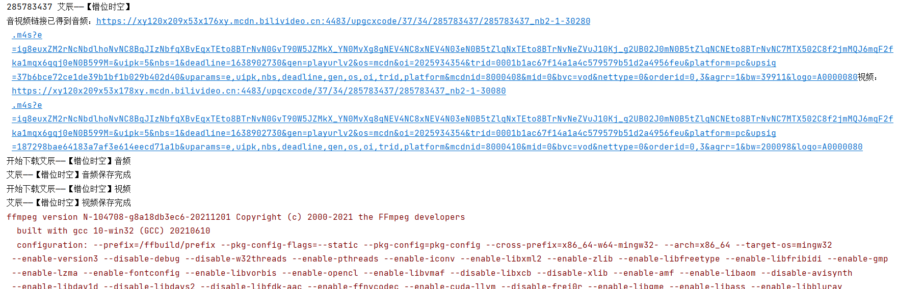

音视频下载正常

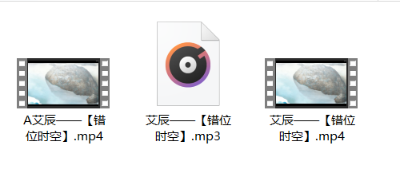

## 弹幕获取

通过查找找到了弹幕的xml文件`https://comment.bilibili.com/285783437.xml`，其中的数字就是我们上面得到的额cid。

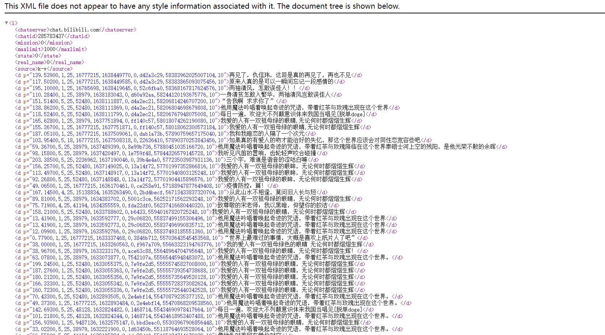对于如此整齐的页面，我们可以使用正则表达式`<d p=".*?">(.*?)</d>`得到一个弹幕列表

```python
import re
import requests

url = 'https://comment.bilibili.com/285783437.xml'
# 根据网址请求
response = requests.get(url=url)
# 使用 utf-8 编码
response.encoding = 'utf-8'
# 将得到的响应解析为文本
text = response.text

comments = re.findall('<d p=".*?">(.*?)</d>', text)
print(comments)

with open("弹幕.txt", mode='a', encoding='utf-8') as f:
    for comment in comments:
        f.write(comment + '\n')
        print(comment)

```

通过这种方式获得了1059条弹幕

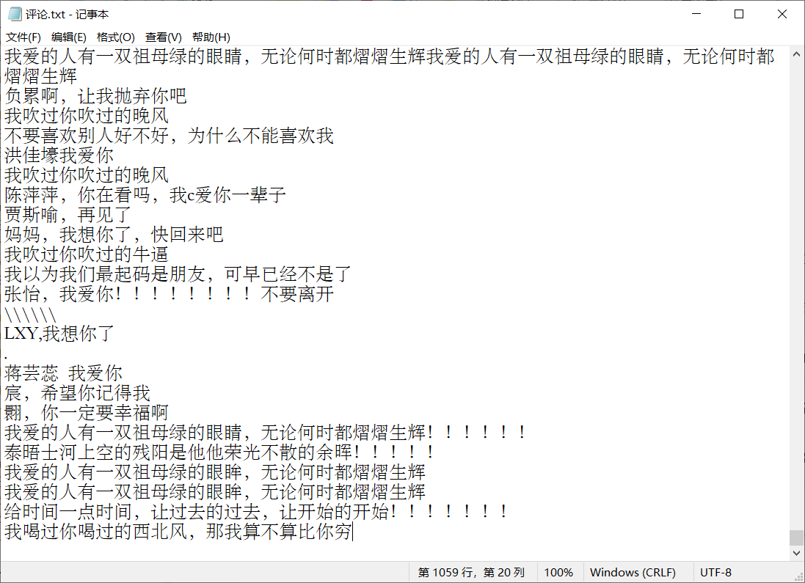

### 弹幕云图

将弹幕转为云图是一种较好的可视化方式

句云图直接从上面程序得到的遍历中取出

```
# 遍历评论
sentence = ""
for comment in comments:
    # print(comment)
    sentence = sentence + ' ' + comment
font = r'C:\Windows\Fonts\simfang.ttf'
w = wordcloud.WordCloud(
    font_path=font,
    background_color='white',
    width=3840,
    height=2160,
)
w.generate(sentence)
w.to_file('错位时空句云图.png')
```


词云图则根据保存的文件读取数据

```
# 导入jieba分词包
import jieba

with open("评论.txt", 'r', encoding="utf-8")as file:
    # 依照行读取文本内容，并返回一个列表
    text_lines = file.readlines()

    #  存放解析出的关键词
    keywords = []
    # 过滤器，去除其中的词
    filter = ['一双', '祖母', '熠熠', '生辉', '无论', '何时', '祖母绿', '熠熠生辉', '眼睛', ]
    for comment in text_lines:
        # jieba 切开句子
        word_list = jieba.lcut_for_search(comment)
        # 列表推导式去除单个字符的干扰项
        word_list = [i for i in word_list if (len(i) > 1 and i not in filter)]
        # 过滤后的列表加在一起
        keywords += word_list

    font = r'C:\Windows\Fonts\simfang.ttf'
    w = wordcloud.WordCloud(
        font_path=font,
        background_color='white',
        width=3840,
        height=2160,
    )
    # 列表最终加载成字符串
    w.generate(" ".join(keywords))
    w.to_file('错位时空词云图.png')
```


## 评论获取

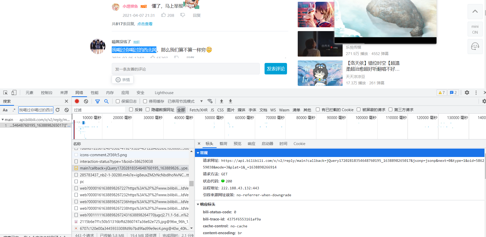

根据搜索我们直接找到了其链接，及请求时所需要的参数

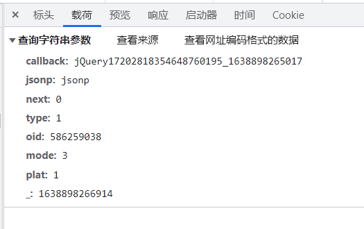

其所返回的同样是json类型数据，评论信息也存在于其中

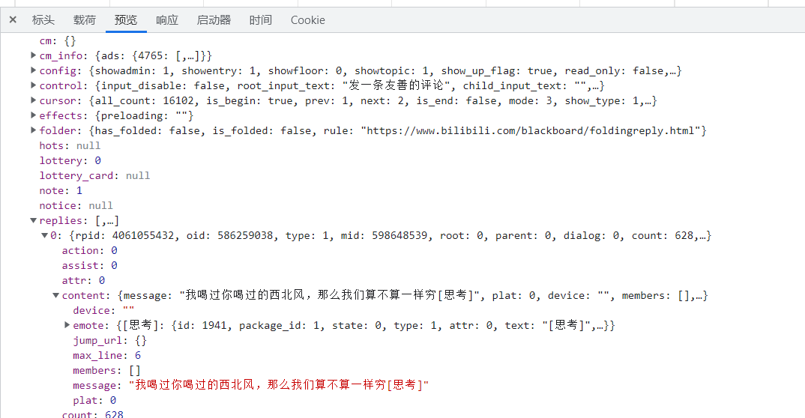

此处的有效信息均位于replies键对应的值中，可采取分步解析

```python
reply = response['data']['replies'][i]
# 将评论时间的时间戳格式转为标准时间格式
t = reply['ctime']
timeArray = time.localtime(t)
otherStyleTime = time.strftime("%Y-%m-%d %H:%M:%S", timeArray)
comment_dict = {
	"评论": reply['content']['message'].replace("\n", ""),
	'时间': otherStyleTime,
	'点赞数': reply['like']
}
```

通过选出两个请求链接比对，以及手动输入进浏览器试探，最终发现第一个参数与最后一个参数无用（不影响输出，而且加上反而无法请求），next参数类似于翻页。oid为该视频的标识符。mode为评论的排序方式，2表示按时间排序，3表示按热度排序。

```http
https://api.bilibili.com/x/v2/reply/main?callback=jQuery17202818354648760195_1638898265017&jsonp=jsonp&next=0&type=1&oid=586259038&mode=3&plat=1&_=1638898266914
https://api.bilibili.com/x/v2/reply/main?callback=jQuery17202818354648760195_1638898265019&jsonp=jsonp&next=3&type=1&oid=586259038&mode=3&plat=1&_=1638899174477
```

得到的有效api为`https://api.bilibili.com/x/v2/reply/main?jsonp=jsonp&next=0&type=1&oid=208143004&mode=3&plat=1`

评论获取程序

```python
import csv
import time
import requests

headers = {
    # 浏览器标识符
    'user-agent': 'Mozilla/5.0 (Windows NT 10.0; Win64; x64) AppleWebKit/537.36 (KHTML, like Gecko) '
                  'Chrome/96.0.4664.45 Safari/537.36',
    # 防盗链
    'referer': 'https://www.bilibili.com/video/'
}


def get_response(url):
    """发送请求"""
    response = requests.get(url=url, headers=headers).json()
    return response


def parse_response(response):
    """对得到的json数据进行解析，选出评论"""

    for i in range(20):
        try:
            reply = response['data']['replies'][i]
            # 将评论时间的时间戳格式转为标准时间格式
            t = reply['ctime']
            timeArray = time.localtime(t)
            otherStyleTime = time.strftime("%Y-%m-%d %H:%M:%S", timeArray)
            comment_dict = {
                "评论": reply['content']['message'].replace("\n", ""),
                '时间': otherStyleTime,
                '点赞数': reply['like']
            }
            fp.writerow(comment_dict)
        except Exception as e:
            print("本评论解析写入失败" + str(i) + str(e))


if __name__ == '__main__':

    oid = 586259038

    with open("评论.csv", mode="a", encoding='utf-8', newline="") as f:
        fp = csv.DictWriter(f, fieldnames=['评论', '时间', '点赞数'])
        fp.writeheader()  # 写入表头
        for next in range(10):
            url = f'https://api.bilibili.com/x/v2/reply/main?jsonp=jsonp&next={next}&type=1&oid={oid}&mode=3&plat=1'
            response = get_response(url)
            parse_response(response)
```

共获得了199条评论数据

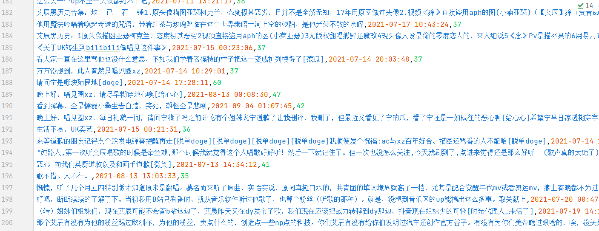

### 评论分析

对获取的199条评论进行分析，统计最初的几十天评论的点赞数，并绘制出折线图。

```python
import numpy as np
import pandas as pd
import matplotlib.pyplot as plt
```

```python
# 读入评论数据 并分行
df = pd.read_csv("评论.csv")
df.columns = ['评论', '时间', '点赞数']
```

```python
# 为了使分月时，第二列显示出数量重新分列，
df.columns = ['评论', '时间', '点赞数']
# 将数据类型转换为日期类型
df['时间'] = pd.to_datetime(df['时间'])
# 将date设置为index
df_time = df.set_index('时间')
# 根据天进行分离
df_month = df_time.resample('D').sum().to_period('D')
# 截取前26天的评论点赞数，间接反应了当时人气
df_month = df_month[0:26]

#设置中文显示
plt.rcParams['font.sans-serif']='SimHei'
# make data
day_list = []
for d in range(22,32):
    day_list.append(f"01-{d}")
for d in range(1,17):
    day_list.append(f"02-{d}")

# plot
fig, ax = plt.subplots(figsize=(14,5))
ax.plot(day_list,df_month['点赞数'], linewidth=2.0)
plt.xticks(rotation=30)
ax.set_xlabel("月份")
ax.set_ylabel("评论量")
plt.show()
```

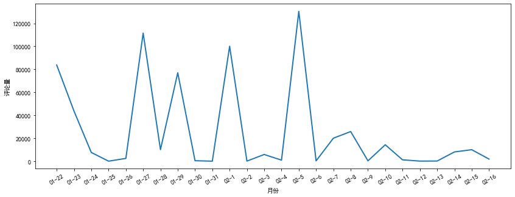

继续不忘初心生成词云图

```python
# 导入jieba分词包
import jieba
import wordcloud


#  存放解析出的关键词
keywords = []
# 过滤器，去除其中的词
filter = ['呜呜', '亚瑟', '克兰' ,'不算']
for comment in df['评论']:
    # jieba 切开句子
    word_list = jieba.lcut_for_search(comment)
    # 列表推导式去除单个字符的干扰项
    word_list = [i for i in word_list if (len(i) > 1 and i not in filter)]
    # 过滤后的列表加在一起
    keywords += word_list

font = r'C:\Windows\Fonts\simfang.ttf'
w = wordcloud.WordCloud(
    font_path=font,
    background_color='white',
    width=3840,
    height=2160,
)
# 列表最终加载成字符串
w.generate(" ".join(keywords))
w.to_file('错位时空评论词云图.png')
```


