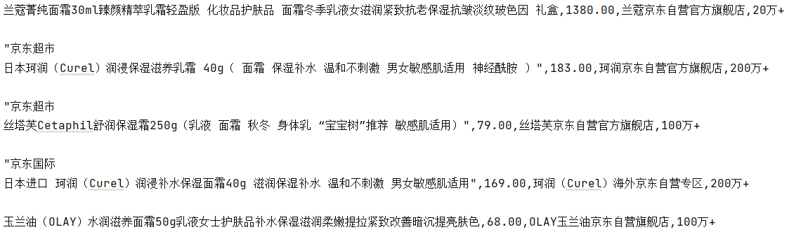

# 获取京东搜索结果并可视化分析

## 数据获取

### 打开浏览器并搜索

首先我们打开网页版本京东，开始像往常一样搜索商品，例如我们想要搜索面霜，这时网址栏就会显示`https://search.jd.com/Search?keyword=面霜&enc=utf-8&wq=面霜&pvid=···`，我们可以让python访问这个网址来获取我们想要的数据，本部分的代码实现为

```python
from selenium import webdriver
def search_thing(keyword):
    """本函数根据输入的关键字进行内容搜索"""
    # 创建一个浏览器对象
    driver  = webdriver.Chrome()
    # 打开搜索好的网页页面 https://search.jd.com/Search?keyword= &enc=utf-8&wq=
    driver.get('https://search.jd.com/Search?keyword='+keyword+'&enc=utf-8&wq='+keyword)
    # 设置浏览器等待时间，以使页面加载完成
    driver.implicitly_wait(5)
    #最大化浏览器
    driver.maximize_window()
```


这里因为我使用的是webdriver这个浏览器驱动，不出意外的话会报错：selenium.common.exceptions.WebDriverException: Message: 'chromedriver' executable needs to be in PATH. Please see https://sites.google.com/a/chromium.org/chromedriver/home，这是因为我们还没有安装chromedriver浏览器驱动，在打开Chrome浏览器设置查看版本号，也可以直接输入chrome://settings/调转到这个页面


随后直接根据提示到[ChromeDriver - WebDriver for Chrome](https://sites.google.com/a/chromium.org/chromedriver/)去下载对应版本的驱动，这里找了很久找不到对应版本，发现可以在输入框里修改path，我们修改为想要的即可https://chromedriver.storage.googleapis.com/index.html?path=96。如果下载错误就继续报错"selenium.common.exceptions.SessionNotCreatedException: Message: session not created:"。都是泪啊。下载后我们解压并放到环境变量里，这里我直接放到了Anaconda3\Library\bin路径下面，借用anaconda的环境变量配置。

### 页面下拉

此时的页面只会加载部分数据，只有下拉才会显示完全，这里使用javascript命令并让driver去执行

```python
def drop_down():
    """本函数实现页面下拉到底的操作"""
    # 将滚动条移动到页面的底部
    driver.execute_script("window.scrollTo(0, document.body.scrollHeight);")
    # 等待数据加载
    time.sleep(3)
```

### 信息解析

我们按下F12，查看源代码，发现找到我们想要的数据，有用的是价格、商品名、评论数、商店名4个部分。

再对全文进行分析，我们发现类似于本页面所有数据放在ul列表中，ul中的一个元素对应一个商品li，li中又有几个div对应着价格、商品名、评论数、商店名等。

使用css选择器时我们要分析标签，例如价格部分分析时可以使用`div.p-price strong i`寻找到内容。


### 元素获取

1. 我们webdriver的css选择器，通过li的 class="gl-item" css属性选择出所有li

   - ```python
     lis = driver.find_elements_by_css_selector('.gl-item')
     ```
2. 对每一个li，根据标签层级以及属性选中内容

   - ```python
     price = li.find_element_by_css_selector('div.p-price strong i').text
     name = li.find_element_by_css_selector('div.p-name.p-name-type-2 a em').text
     commit = li.find_element_by_css_selector('div.p-commit strong a').text
     shop = li.find_element_by_css_selector('div.p-shop span a').text
     ```
3. 此时获得的数据会出现换行等大量无效数据，这时可以使用replace替换掉，先去除换行符，在去除引号，最后去除京东超市和京东国际`name = name.replace('京东超市','').replace('京东国际','').replace('"','').replace('\n','')`

   
4. 将改进后的内容保存进csv文件中，为了提高效率此部分由主函数负责

   - ```python
     # 打开文件 keyword.csv文件，追加数据格式，使用utf-8编码,新建一行不换行
     with open("{}.csv".format(keyword),mode="a",encoding='utf-8',newline="") as f:
         # 创建笔，用来在问价上写入数据
         csvpencil = csv.writer(f)
         ···
         csvpencil.writerow([name,price,shop,commit])
     ```

本部分完整的函数如下

```python
def get_data():
    """本函数使用css选择器进行页面解析，分离出各成分"""
    # 异常处理，即使有的数据出问题也不会影响程序继续运行
    try:
        # 通过li的 class="gl-item" css属性选择出所有li
        lis = driver.find_elements_by_css_selector('.gl-item')
        for li in lis:
            price = li.find_element_by_css_selector('div.p-price strong i').text
            name = li.find_element_by_css_selector('div.p-name.p-name-type-2 a em').text
            name = name.replace('京东超市', '').replace('京东国际', '').replace('"', '').replace('\n', '')
            commit = li.find_element_by_css_selector('div.p-commit strong a').text
            shop = li.find_element_by_css_selector('div.p-shop span a').text
            print(name, price, shop, commit)
            csvpencil.writerow([name, price, shop, commit])
    except Exception as e:
        print(e)
```

### 翻页

找到下一页按钮对应的标签，复制selector，使用css选择器选中并click点击

```python
def turn_page():
    """本函数用于翻页"""
    driver.find_element_by_css_selector('#J_bottomPage > span.p-num > a.pn-next').click()
```

### 完整代码

将四个函数按顺序运行，并将drop_down()、get_data()、turn_page()循环一定次数。即可实现一次数据获取

```python
from selenium import webdriver
import csv
import time


def search_thing(keyword):
    """本函数根据输入的关键字进行内容搜索"""
    # 打开搜索好的网页页面 https://search.jd.com/Search?keyword= &enc=utf-8&wq=
    driver.get('https://search.jd.com/Search?keyword=' + keyword + '&enc=utf-8&wq=' + keyword)
    # 设置浏览器等待时间，以使页面加载完成
    driver.implicitly_wait(3)
    # 最大化浏览器
    driver.maximize_window()


def drop_down():
    """本函数实现页面下拉到底的操作"""
    # 将滚动条移动到页面的底部
    driver.execute_script("window.scrollTo(0, document.body.scrollHeight);")
    # 等待数据加载
    time.sleep(3)


def get_data():
    """本函数使用css选择器进行页面解析，分离出各成分"""
    # 异常处理，即使有的数据出问题也不会影响程序继续运行
    try:
        # 通过li的 class="gl-item" css属性选择出所有li
        lis = driver.find_elements_by_css_selector('.gl-item')
        for li in lis:
            price = li.find_element_by_css_selector('div.p-price strong i').text
            name = li.find_element_by_css_selector('div.p-name.p-name-type-2 a em').text
            name = name.replace('京东超市', '').replace('京东国际', '').replace('"', '').replace('\n', '')
            commit = li.find_element_by_css_selector('div.p-commit strong a').text
            shop = li.find_element_by_css_selector('div.p-shop span a').text
            print(name, price, shop, commit)
            csvpencil.writerow([name, price, shop, commit])
    except Exception as e:
        print(e)


def turn_page():
    """本函数用于翻页"""
    driver.find_element_by_css_selector('#J_bottomPage > span.p-num > a.pn-next').click()


if __name__ == '__main__':
    # keyword = input("请输入想要搜索的商品：")
    keyword = '面霜'
    # 创建一个webdriver浏览器实例
    driver = webdriver.Chrome()

    search_thing(keyword)
    # 打开文件 keyword.csv文件，追加数据格式，使用utf-8编码,新建一行不换行
    with open("{}.csv".format(keyword), mode="a", encoding='utf-8', newline="") as f:
        # 创建笔，用来在问价上写入数据
        csvpencil = csv.writer(f)
        # 写入表头
        csvpencil.writerow(["name", "price", "shop", "commit"])
        # 进行5个页面的下拉，数据获取，翻页
        for _ in range(5):
            drop_down()
            get_data()
            turn_page()
    # 关闭浏览器
    driver.quit()
```

## 数据分析

说道数据分析少不了数据可视化，二数据可视化就不得不提强悍的jupyter，

### 数据导入

```python
import pandas as pd
import numpy as np
import matplotlib.pyplot as plt
```

```python
data = pd.read_csv("面霜.csv")
data
```

<table border="1" class="dataframe">
  <thead>
    <tr style="text-align: right;">
      <th></th>
      <th>name</th>
      <th>price</th>
      <th>shop</th>
      <th>commit</th>
    </tr>
  </thead>
  <tbody>
    <tr>
      <th>0</th>
      <td>兰蔻菁纯面霜30ml臻颜精萃乳霜轻盈版 化妆品护肤品 面霜冬季乳液女滋润紧致抗老保湿抗皱淡纹...</td>
      <td>1380.0</td>
      <td>兰蔻京东自营官方旗舰店</td>
      <td>20万+</td>
    </tr>
    <tr>
      <th>1</th>
      <td>丝塔芙Cetaphil舒润保湿霜250g（乳液 面霜 秋冬 身体乳 “宝宝树”推荐 敏感肌适用）</td>
      <td>79.0</td>
      <td>丝塔芙京东自营官方旗舰店</td>
      <td>100万+</td>
    </tr>
    <tr>
      <th>2</th>
      <td>日本珂润（Curel）润浸保湿滋养乳霜 40g（ 面霜 保湿补水 温和不刺激 男女敏感肌适用...</td>
      <td>183.0</td>
      <td>珂润京东自营官方旗舰店</td>
      <td>200万+</td>
    </tr>
    <tr>
      <th>3</th>
      <td>日本进口 珂润（Curel）润浸补水保湿面霜40g 滋润保湿补水 温和不刺激 男女敏感肌适用</td>
      <td>169.0</td>
      <td>珂润（Curel）海外京东自营专区</td>
      <td>200万+</td>
    </tr>
    <tr>
      <th>4</th>
      <td>玉兰油（OLAY）水润滋养面霜50g乳液女士护肤品补水保湿滋润柔嫩提拉紧致改善暗沉提亮肤色</td>
      <td>68.0</td>
      <td>OLAY玉兰油京东自营旗舰店</td>
      <td>100万+</td>
    </tr>
    <tr>
      <th>...</th>
      <td>...</td>
      <td>...</td>
      <td>...</td>
      <td>...</td>
    </tr>
    <tr>
      <th>254</th>
      <td>大宝护肤面霜两瓶装 护肤品套装美容补水保湿男女士家用面霜 大宝美容日霜50g*2瓶</td>
      <td>33.9</td>
      <td>大宝旗舰店</td>
      <td>2000+</td>
    </tr>
    <tr>
      <th>255</th>
      <td>PMPM千叶玫瑰神经酰胺舒缓修护屏障受损褪红嫩肤滋润面霜25g</td>
      <td>119.0</td>
      <td>PMPM京东自营旗舰店</td>
      <td>1万+</td>
    </tr>
    <tr>
      <th>256</th>
      <td>韩束高保湿面霜女补水保湿润肤霜早晚护肤日霜 巨水光弹润精华霜水光素颜霜 高保湿精华霜50ml</td>
      <td>89.0</td>
      <td>洲美化妆品专营店</td>
      <td>500+</td>
    </tr>
    <tr>
      <th>257</th>
      <td>大宝SOD蜜200ml 补水滋养男女面霜乳液护肤品冬季脸部润肤乳液 大宝SOD蜜200ml*2</td>
      <td>31.9</td>
      <td>大宝旗舰店</td>
      <td>10万+</td>
    </tr>
    <tr>
      <th>258</th>
      <td>肌琳莎 （JILINSHA ）凡士林润肤乳保湿面霜乳液 （滋润补水 清爽不油全身可用）男女生...</td>
      <td>29.0</td>
      <td>梵贞京东自营旗舰店</td>
      <td>5万+</td>
    </tr>
  </tbody>
</table>
<p>259 rows × 4 columns</p>

### 店铺出现次数统计

```python
# 数据拆分
data.columns = ["name", "price", "shop", "commit"]
shoplist = data["shop"]
shoplist
```

0            兰蔻京东自营官方旗舰店
1           丝塔芙京东自营官方旗舰店
2            珂润京东自营官方旗舰店
3      珂润（Curel）海外京东自营专区
4         OLAY玉兰油京东自营旗舰店
...
254                大宝旗舰店
255          PMPM京东自营旗舰店
256             洲美化妆品专营店
257                大宝旗舰店
258            梵贞京东自营旗舰店
Name: shop, Length: 259, dtype: object

```python
def list_to_dict(arr):
    """列表转为店铺出现次数字典"""
    #去重
    key = np.unique(arr)
    result = {}
    # 循环每一个去重后的店铺
    for k in key:
        mask = (arr == k)  # 如果arr=k值，就赋值，返回结果是 True False的列表
        arr_new = arr[mask]  # 添加这个户型所对应的值（取出True的数据放入arr_new中）
        v = arr_new.size  # 取出出现次数
        result[k] = v  # 创建键值对，加入dict中
    return result

shop_info = list_to_dict(shoplist)


# 字典推导式，去除出现次数小于2的店铺
shop_dict = dict((key, value) for key, value in shop_info.items() if value > 1 )
# 将字典按照元素值进行逆序排序
shop_dict = dict(sorted(shop_dict.items(), key=lambda x: x[1], reverse=True))
df = pd.DataFrame({'店铺名': [x for x in shop_dict.keys()], 
              '出现次数': [x for x in shop_dict.values()]})

df
```

<table border="1" class="dataframe">
  <thead>
    <tr style="text-align: right;">
      <th></th>
      <th>店铺名</th>
      <th>出现次数</th>
    </tr>
  </thead>
  <tbody>
    <tr>
      <th>0</th>
      <td>大宝京东自营旗舰店</td>
      <td>13</td>
    </tr>
    <tr>
      <th>1</th>
      <td>OLAY玉兰油京东自营旗舰店</td>
      <td>10</td>
    </tr>
    <tr>
      <th>2</th>
      <td>兰蔻京东自营官方旗舰店</td>
      <td>10</td>
    </tr>
    <tr>
      <th>3</th>
      <td>Estee Lauder雅诗兰黛京东自营官方旗舰店</td>
      <td>9</td>
    </tr>
    <tr>
      <th>4</th>
      <td>科颜氏Kiehl's京东自营官方旗舰店</td>
      <td>8</td>
    </tr>
    <tr>
      <th>5</th>
      <td>欧莱雅京东自营官方旗舰店</td>
      <td>6</td>
    </tr>
    <tr>
      <th>6</th>
      <td>欧莱雅男士京东自营官方旗舰店</td>
      <td>6</td>
    </tr>
    <tr>
      <th>7</th>
      <td>大宝旗舰店</td>
      <td>5</td>
    </tr>
    <tr>
      <th>8</th>
      <td>娇兰（Guerlain）京东自营官方旗舰店</td>
      <td>5</td>
    </tr>
    <tr>
      <th>9</th>
      <td>薇诺娜官方旗舰店</td>
      <td>5</td>
    </tr>
    <tr>
      <th>10</th>
      <td>SK-II京东自营官方旗舰店</td>
      <td>4</td>
    </tr>
<tr>
      <th>·</th>
      <td>···</td>
      <td>·</td>
    </tr>
    <tr>
      <th>41</th>
      <td>百雀羚京东自营官方旗舰店</td>
      <td>2</td>
    </tr>
    <tr>
      <th>42</th>
      <td>美加净旗舰店</td>
      <td>2</td>
    </tr>
    <tr>
      <th>43</th>
      <td>美芝霖化妆品专营店</td>
      <td>2</td>
    </tr>
    <tr>
      <th>44</th>
      <td>资生堂京东自营专区</td>
      <td>2</td>
    </tr>
    <tr>
      <th>45</th>
      <td>资生堂海外京东自营旗舰店</td>
      <td>2</td>
    </tr>
    <tr>
      <th>46</th>
      <td>赫恩化妆品旗舰店</td>
      <td>2</td>
    </tr>
    <tr>
      <th>47</th>
      <td>雅漾（Avene）海外京东自营旗舰店</td>
      <td>2</td>
    </tr>
    <tr>
      <th>48</th>
      <td>馥蕾诗（Fresh）京东自营专区</td>
      <td>2</td>
    </tr>
  </tbody>
</table>
```python
fig = plt.figure(figsize=(15, 9))  # 设置画布大小
plt.rcParams['font.sans-serif'] = ['KaiTi']  # 指定默认字体
plt.bar(df['店铺名'], df['出现次数'], width=0.5,
        color=['gold', 'cyan', 'cornflowerblue', 'violet', 'tomato', 'orange'])  # 柱状图

plt.xlabel('店铺名')  # 横坐标标注店铺名
fig.autofmt_xdate()  # 自动旋转
plt.ylabel('出现次数')  # 纵坐标标注出现次数
plt.title('店铺出现次数图')  # 标题-店铺出现次数图
plt.show()  # 输出本次图形

```


### 品牌占比
从店铺名中将自营、官方、旗舰店等去除，在统计各品牌出现次数,这里可以调用上文中的list_to_dict(arr)统计品牌出现的次数


```python
shoplist = data["shop"]
# 列表存储品牌出现过的名字
brandlist = []
# 集合直接实现去重
brandset = set()
# 从店铺名获取品牌
for brand in shoplist:
    brand = brand.replace("京东", "").replace("自营", "").replace("官方", "").replace("旗舰店", "")
    brandlist.append(brand)
    brandset.add(brand)

branddict = {}
for brand in brandset:
    value = brandlist.count(brand)
    branddict[brand] = value

# 字典推导式，去除出现次数小于2的店铺
brand_dict = dict((key, value) for key, value in branddict.items() if value > 1 )
# 将字典按照元素值进行逆序排序
brand_dict = dict(sorted(brand_dict.items(), key=lambda x: x[1], reverse=True))
df2 = pd.DataFrame({'品牌名': [x for x in brand_dict.keys()], 
              '出现次数': [x for x in brand_dict.values()]})
df2
```

<table border="1" class="dataframe">
  <thead>
    <tr style="text-align: right;">
      <th></th>
      <th>品牌名</th>
      <th>出现次数</th>
    </tr>
  </thead>
  <tbody>
    <tr>
      <th>0</th>
      <td>大宝</td>
      <td>18</td>
    </tr>
    <tr>
      <th>1</th>
      <td>兰蔻</td>
      <td>10</td>
    </tr>
    <tr>
      <th>2</th>
      <td>OLAY玉兰油</td>
      <td>10</td>
    </tr>
    <tr>
      <th>3</th>
      <td>Estee Lauder雅诗兰黛</td>
      <td>9</td>
    </tr>
    <tr>
      <th>4</th>
      <td>科颜氏Kiehl's</td>
      <td>8</td>
    </tr>
    <tr>
      <th>5</th>
      <td>欧莱雅</td>
      <td>7</td>
    </tr>
    <tr>
      <th>6</th>
      <td>自然堂</td>
      <td>7</td>
    </tr>
    <tr>
      <th>···</th>
      <td>···</td>
      <td>···</td>
    </tr>
    <tr>
      <th>39</th>
      <td>形象美</td>
      <td>2</td>
    </tr>
    <tr>
      <th>40</th>
      <td>丁家宜（TJOY）</td>
      <td>2</td>
    </tr>
    <tr>
      <th>41</th>
      <td>妮维雅（NIVEA）海外</td>
      <td>2</td>
    </tr>
    <tr>
      <th>42</th>
      <td>馥蕾诗（Fresh）专区</td>
      <td>2</td>
    </tr>
    <tr>
      <th>43</th>
      <td>玉泽</td>
      <td>2</td>
    </tr>
    <tr>
      <th>44</th>
      <td>Durrell海外</td>
      <td>2</td>
    </tr>
    <tr>
      <th>45</th>
      <td>资生堂专区</td>
      <td>2</td>
    </tr>
  </tbody>
</table>
</div>

```python
plt.rcParams['font.sans-serif']='SimHei'#设置中文显示
plt.figure(figsize=(10,10))#将画布设定为正方形，则绘制的饼图是正圆
label=df2['品牌名']#定义饼图的标签，标签是列表
colors = ['lightcoral', 'bisque', 'lightgreen', 'lightcyan', 'cornflowerblue','mediumslateblue','violet']
#plt.pie(values[-1,3:6],explode=explode,labels=label,autopct='%1.1f%%')#绘制饼图
values=df2['出现次数']
plt.pie(values,labels=label,colors=colors,autopct='%1.1f%%')#绘制饼图
plt.title('品牌出现饼图饼图')#绘制标题
#plt.savefig('./2018年饼图')#保存图片
plt.show()
```


### 价格分布折线图

```python
data["price"]
mi_price = int(min(data["price"]))+1
x1 = range(0,len(data["price"]))
fig = plt.figure(figsize=(15, 9))  # 设置画布大小
plt.plot(x1,data["price"],label='Price line',linewidth=1,color='cyan',marker='o',markerfacecolor='blue',markersize=12)

plt.xlabel('编号')
plt.ylabel('价格')
plt.title('面霜价格分布折线图')
plt.legend()
plt.show()
```


### 评论量分析

在获得数据时是按照商品展示的顺序一一获取的，即在data列表中个商品的顺序就相当于京东给出的推荐顺序，我们尝试分析评论量与京东推荐机制的关系。根据散点图的分布情况我们可以看出排在前边的几家评论量都比较多

```python
data['commit']
commit_num = []
# 由于评论的形式大多以···万+的形式，首先进行单位转换
for commit in data['commit']:
    commit = commit.replace("+","")
    valueStr = str(commit)
    # 寻找万的位置
    idxOfWan = valueStr.find('万')
    # 找不到万的位置，没有万
    if idxOfWan != -1:
        commit_num.append(int(valueStr[:idxOfWan]) * 1e4)
    elif idxOfWan == -1:
        commit_num.append(int(valueStr))
    else:
        print(f"{valueStr}格式有误")
        commit_num.append(-1)
print(commit_num)
```

[200000.0, 1000000.0, 2000000.0, 2000000.0,··· 2000, 10000.0, 500, 100000.0, 50000.0]

```python
x1 = range(0,len(data['commit']))
fig = plt.figure(figsize=(15, 9))  # 设置画布大小
plt.scatter(x1,commit_num,label='Price line',color='gold',marker='o')

plt.xlabel('编号')
plt.ylabel('评论量')
plt.title('评论量与显示顺序折线图')
plt.legend()
plt.show()
```


### 词云图

先使用jieba模块对冗长的商品名分词，再使用wordcloud生成词云图

```python
import wordcloud
import jieba

words = ""
for name in data["name"]:
    words_list = jieba.cut(name, cut_all=False) # jieba分词精确模式
    words += " ".join(words_list)

font = r'C:\Windows\Fonts\simfang.ttf'
w = wordcloud.WordCloud(
    font_path=font,
    background_color='white',
    width=3840,
    height=2160,
)
w.generate(words)
w.to_file('词云图.png')
```


## 具体分析

经过综合数据挑选，选出了'玉兰油（OLAY）大红瓶面霜50g', '科颜氏（Kiehl's）高保湿面霜50ml', '珂润（Curel）润浸保湿滋养乳霜40g'三款商品做最后的选择，进入网页获取评论数据，随后分析大家买后的感受，每家店铺分别获取100条评论进行分析，同时也获取评论标签。

### 评论获取

在本次的selenium选择中，由于星级的数据存放于class之中，故在css选择器定位到标签后使用get_attribute('class')将其属性值提取出；部分评论又没有时间、物品，在提取时时长报错`Message: no such element: Unable to locate element`，故使用try来处理问题，由于担心出现nan的情况，此次主动填入''空字符串；进行翻页时出现了`selenium.common.exceptions.ElementClickInterceptedException: Message: element click intercepted: `的错误信息，此次又改进翻页方式，使用更加稳定的JavaScript语句实现翻页，

```python
from selenium import webdriver
import csv
import time


def search_thing(url):
    """本函数根据输入的url进行内容搜索"""
    driver.get(url)
    # 设置浏览器等待时间，以使页面加载完成
    driver.implicitly_wait(3)
    # 最大化浏览器
    driver.maximize_window()


def drop_down():
    """本函数实现页面下拉到底的操作"""
    # 将滚动条移动到页面的底部
    driver.execute_script("window.scrollTo(0, document.body.scrollHeight);")
    # 等待数据加载
    time.sleep(3)


def get_commit():
    """本函数使用css选择器进行页面解析，分离出各成分"""
    # 异常处理，即使有的数据出问题也不会影响程序继续运行
    try:
        # 通过li的 class="comment-item" css属性选择出所有div 评论
        divs = driver.find_elements_by_css_selector('.comment-item')
        for div in divs:
            commit = div.find_element_by_css_selector('div.comment-column.J-comment-column > p.comment-con').text
            commit = commit.replace('\n', '')
            # 由于星级存在于class中，以class="comment-star star5"的形式存在，使用get_attribute('class')将其提取出
            start = div.find_element_by_css_selector('div > div.comment-star').get_attribute('class')
            # 部分评论并没有时间、物品，异常处理，没有就填入FALSE
            try:
                order = div.find_element_by_css_selector('div > div.comment-message > '
                                                         'div.order-info > span').text

                time = div.find_element_by_css_selector('div > div.comment-message > '
                                                        'div.order-info > span:nth-child(4)').text
                print(commit, start, order, time)
            except Exception as e:
                time = ''
                order = ''
                print(e)
            csvpencil.writerow([time, order, start, commit])
    except Exception as e:
        print(e)


def turn_page():
    """本函数用于翻页"""
    element = driver.find_element_by_css_selector('#comment-0 > div.com-table-footer > div > div > a.ui-pager-next')
    driver.execute_script("arguments[0].click();", element)


def main_commits(url, name):
    search_thing(url)
    # 获取评论标签
    get_tags(name)
    # # 进行10个页面的下拉，数据获取，翻页
    for _ in range(10):
        drop_down()
        get_commit()
        turn_page()


def get_tags(name):
    with open("标签数据.csv", mode="a", encoding='utf-8', newline="") as f2:
        # 创建笔，用来在问价上写入数据
        csvpencil2 = csv.writer(f2)
        # 写入表头
        csvpencil2.writerow(["商店名", "标签信息"])
        # 下拉使浏览器加载评论数据
        drop_down()
        time.sleep(3)
        # 通过tag 的class=" tag-1"来找到所有标签
        tags = driver.find_elements_by_css_selector('div.comment-info.J-comment-info > div.percent-info > div > span')
        for tag in tags:
            tagtext = tag.text
            csvpencil2.writerow([name, tagtext])


if __name__ == '__main__':
    # 创建一个webdriver浏览器实例
    driver = webdriver.Chrome()
    # 三家面霜的链接与名称
    urls = ['https://item.jd.com/819172.html', 'https://item.jd.com/100022610088.html',
            'https://item.jd.com/1750036.html']
    names = ['玉兰油（OLAY）大红瓶面霜50g', "科颜氏（Kiehl's）高保湿面霜50ml", '珂润（Curel）润浸保湿滋养乳霜40g']

    try:
        for i in range(3):
            # 创建csv文件，末尾加数据，utf-8编码,空新建
            with open("{}.csv".format(names[i]), mode="a", encoding='utf-8', newline="") as f:
                # 创建笔，用来在问价上写入数据
                csvpencil = csv.writer(f)
                # 写入表头
                csvpencil.writerow(['time', 'order', 'start', 'commit'])
                main_commits(urls[i], names[i])
    # 确保无论如何都会关闭
    finally:
        # 关闭浏览器
        driver.quit()
```

### 评论数据分析
根据三个商品所在店铺的评论信息，进行对比，选出商品。

#### 准备工作


```python
#导包
import numpy as np
import pandas as pd
import matplotlib.pyplot as plt
```


```python
# 文件读取
from pyecharts.render import make_snapshot

tags = pd.read_csv('标签数据.csv')
tags.columns = ["商店名", "标签信息"]

olay = pd.read_csv("玉兰油（OLAY）大红瓶面霜50g.csv")
olay.columns=['time', 'order','start', 'commit']

curel = pd.read_csv("珂润（Curel）润浸保湿滋养乳霜40g.csv")
curel.columns=['time', 'order','start' ,'commit']

kiehls = pd.read_csv("科颜氏（Kiehl's）高保湿面霜50ml.csv")
kiehls.columns=['time', 'order','start' ,'commit']
```

#### 标签数据分析
根据商品名将个商品的数据筛选出来，在通过截取将各标签分解位名称、数据


```python
olaytag = tags[(tags['商店名'].isin (['玉兰油（OLAY）大红瓶面霜50g']))]
cureltag = tags[(tags['商店名'].isin (['珂润（Curel）润浸保湿滋养乳霜40g']))]
kiehlstag = tags[(tags['商店名'].isin (['科颜氏（Kiehl\'s）高保湿面霜50ml']))]
```

先将格式转成一大段字符串，再使用正则表达式进行匹配，得到两个列表，刚好可以用来进行数据可视化呈现。
`([\u4e00-\u9fa5]+)`匹配中文汉字，`(\d+)`匹配出数字


```python
import re
olaytagstr = " ".join(olaytag['标签信息'])
olaytagname = re.findall("([\u4e00-\u9fa5]+)",olaytagstr)
olaytagnumber = re.findall("(\d+)",olaytagstr)

cureltagstr = " ".join(cureltag['标签信息'])
cureltagname = re.findall("([\u4e00-\u9fa5]+)",cureltagstr)
cureltagnumber = re.findall("(\d+)",cureltagstr)

kiehlstagstr = " ".join(kiehlstag['标签信息'])
kiehlstagname = re.findall("([\u4e00-\u9fa5]+)",kiehlstagstr)
kiehlstagnumber = re.findall("(\d+)",kiehlstagstr)
```


```python
plt.rcParams['font.sans-serif']=['SimHei'] #用来正常显示中文标签
fig,ax= plt.subplots(1,3,figsize =(18,6))
colors = ['lightcoral', 'bisque', 'lightgreen', 'lightcyan', 'cornflowerblue','mediumslateblue','violet']

labels = olaytagname[:-5]
sizes = olaytagnumber[:-5]
explode = (0,0,0,0.1,0,0,0)
ax[0].pie(sizes,explode=explode,labels=labels,colors=colors,autopct='%1.1f%%',shadow=False,startangle=150)
ax[0].set_title("玉兰油（OLAY）")

labels = cureltagname[:-5]
sizes = cureltagnumber[:-5]
explode = (0,0,0.1,0,0,0,0)
ax[1].pie(sizes,explode=explode,labels=labels,colors=colors,autopct='%1.1f%%',shadow=False,startangle=150)
ax[1].set_title("珂润（Curel）")

labels = kiehlstagname[:-4]
sizes = kiehlstagnumber[:-4]
explode = (0,0,0,0,0,0.1,0)
ax[2].pie(sizes,explode=explode,labels=labels,colors=colors,autopct='%1.1f%%',shadow=False,startangle=150)
ax[2].set_title("科颜氏（Kiehl\'s）")

fig.suptitle('三款面霜评论标签')
plt.show()
```


    


#### 三商品中共有标签分析
列表推导式求的两个列表的交集，返现没有返回值，后发现确实没有交集


```python
totalabel = [j for j in olaytagname if (j in cureltagname and j in kiehlstagname)]
```

#### 星级分析
将个商品的星级提出出来并使用正则表达式`\d`直接匹配出数字列表，再通过collections的Counter函数转成字典，进而绘图


```python
import collections

olaystartinfo = " ".join(olay['start'])
olaystart = re.findall("(\d)",olaystartinfo)
olaystartdict = collections.Counter(olaystart)

curelstartinfo = "".join(curel['start'])
curelstart = re.findall("(\d)",curelstartinfo)
curelstartdict = collections.Counter(curelstart)

kiehlsstartinfo = " ".join(kiehls['start'])
kiehlsstart = re.findall("(\d)",kiehlsstartinfo)
kiehlsstartdict = collections.Counter(kiehlsstart)
```


```python
olayy = [olaystartdict[f'{i}'] for i in range(1,6)]
kiehlsy = [kiehlsstartdict[f'{i}'] for i in range(1,6)]
curely = [curelstartdict[f'{i}'] for i in range(1,6)]


# 三组数据
plt.figure(figsize=(12, 6))
labels = ['1星','2星','3星','4星','5星']
x = np.arange(len(labels))# x轴刻度标签位置
width = 0.25  # 柱子的宽度
# 计算每个柱子在x轴上的位置，保证x轴刻度标签居中
# x - width，x， x + width即每组数据在x轴上的位置
plt.bar(x - width, olayy, width, label='OLAY')
plt.bar(x, kiehlsy, width, label='Kiehl\'s')
plt.bar(x + width, curely, width, label='Curel')
plt.xlabel('星级')
plt.ylabel('数量')
plt.title('三商店对比')
plt.xticks(x, labels=labels)
plt.legend()
plt.show()
```


    


#### 评论词云图
本次使用pyecharts词云图，使用jieba分词
本次生成词云图用时较长，需要慢慢等待，但结果是好的，生成了三个有动效的html文件


```python
import jieba  # 中文字典用于分词
import collections
import pyecharts.options as opts
from pyecharts.charts import WordCloud


def creatWordCloud(df,name):
    words = []
    commits = df['commit']
    for commit in commits:
        word = jieba.lcut_for_search(commit)
        word = [i for i in word if len(i)>1]
        words +=word

    wordict = collections.Counter(words)
    # 提取处前200出现词语生成词云图
    data = wordict.most_common(400)

    w = (
        WordCloud()
        .add(series_name=f"{name}词云图", data_pair=data, word_size_range=[6, 66])
        .set_global_opts(
            title_opts=opts.TitleOpts(
                title=f"{name}词云图", title_textstyle_opts=opts.TextStyleOpts(font_size=23)
            ),
            tooltip_opts=opts.TooltipOpts(is_show=True),
        )

    )
    w.render(f"{name}词云图.html")

creatWordCloud(olay,"OLAY")
creatWordCloud(olay,"Curel")
creatWordCloud(kiehls,"Kiehl\'s")
```


