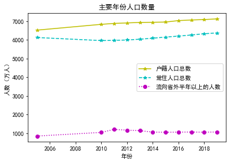

# 安徽省人口数据分析 可视化呈现
代码仓库：`https://github.com/SKPrimin/PythonCrawler/tree/master/population`
## 需求分析

近年来有关人口生育率的问题一直是社会的焦点问题，而安徽在人口问题上更是全国的舆论焦点。。。。

## 数据获取

### 数据形式分析

本次我们从安徽统计局获取人口数据，进行数据可视化呈现，我们访问[安徽统计局](http://tjj.ah.gov.cn/)查询数据，刚好安徽统计局已经对数据进行了集中展示，并编写了统计年鉴，我们查询[安徽统计年鉴—2020](http://tjj.ah.gov.cn/oldfiles/tjj/tjjweb/tjnj/2020/cn.html)中人口部分。


开始F12浏览器调试，刷新页面并监听，发现是通过局部刷新来加载页面，并且标明了请求网址，即数据保存的页面。同时还通过网址比对发现个链接中只有cn3-1，cn3-2部分不同且恰好对应表格编号

- 

进入数据实际所在页面，对元素进行解析

- 发现tr中height="29"属性对应的是表格名称

  - 
- tr中height="29"属性对应的是各数据代表含义以及数据项

  - 

由此发现可以使用request进行数据请求，使用Xpath进行数据提取，再使用openpyxl进行数据保存

这里顺便说明一点，如果提取时使用utf-8编码格式会出现乱码，使用常见的gbk也会出现乱码，后来查看页面源代码才发现使用的竟然是我国上世纪八十年代设计的gb2312。

### 数据下载程序设计

```python
from lxml import etree
from openpyxl import Workbook
import requests


def getdownload(url):
    # UA伪装
    header = {
        "User-Agent": "Mozilla/5.0 (Windows NT 10.0; Win64; x64) AppleWebKit/537.36 (KHTML, like Gecko) Chrome/96.0.4664.45 Safari/537.36 Edg/96.0.1054.29"
    }
    # 发起请求，带3参数
    r = requests.get(url=url, headers=header)
    # 将编码格式调成gb2312
    r.encoding = "gb2312"
    # 转成文本文件
    htm_text = r.text
    # 将文件本地保存下来，同时类型修改为html，编码格式改为utf-8 本文件仅做临时保存用，数据会储存在csv文件中
    with open("tmp.html", 'w', encoding='utf-8') as f:
        f.write(htm_text)


def getdata(id):
    # 转成标准的xml
    parser = etree.HTMLParser(encoding="utf-8")
    tree = etree.parse('tmp.html', parser=parser)
    # 解析出标题 大部分是 x166属性
    title = tree.xpath('/html/body/table/tr/td[@class="xl66"]/text()')
    # 小部分是x165属性
    if len(title) == 0:
        # 只有一个14号表格是x165属性
        classattribute = 'xl65' if id != 14 else 'xl67'
        title = tree.xpath(f'/html/body/table/tr/td[@class="{classattribute}"]/text()')
    # 返回的title是一个列表，转成一个str格式
    title = ''.join(title)
    print(title)
    # 获取表格中有效数据部分共有多少行
    elementnum = len(tree.xpath('/html/body/table/tr[@height="19"]'))
    ws = wb.create_sheet(title=f'{title}')  # 新建sheel插入到最后
    # 对所有行有效元素进行一一提取
    for i in range(1, elementnum + 1):
        tdele = tree.xpath(f'/html/body/table/tr[@height="19"][{i}]/td/text()')
        print(tdele)
        # 逐行添加数据
        ws.append(tdele)


if __name__ == '__main__':
    # 实例化表格
    wb = Workbook()
    for id in range(1, 27):
        url = f'http://tjj.ah.gov.cn/oldfiles/tjj/tjjweb/tjnj/2020/cn/3/cn3-{id}.files/sheet001.htm'
        getdownload(url)
        getdata(id)

    wb.save('ahpopulation.xlsx')
```

至此，得到了一个有26个sheel的xlsx表格,共有如下数据：


| 表格id | 表格名                                 | 表格id | 表格名                                           |
| -------- | ---------------------------------------- | -------- | -------------------------------------------------- |
| 3-1    | 主要年份人口指标                       | 3-14   | 各市按性别分的15岁及以上文盲人口 (2019年)        |
| 3-2    | 主要年份人口系数                       | 3-15   | 各市每十万人口拥有受教育程度人口（2019年）       |
| 3-3    | 六次全省人口普查基本情况               | 3-16   | 各市2019―2020学年小学初中入学率状况             |
| 3-4    | 各市主要年份人口城镇化率               | 3-17   | 各市婚姻人口构成（2019年）                       |
| 3-5    | 各市常住人口出生率、死亡率（2019年）   | 3-18   | 全省育龄妇女分年龄孩次的生育率（2019年）         |
| 3-6    | 各市主要人口指标（2019年）             | 3-19   | 各市按行业分的在业人口比例（2019年）             |
| 3-7    | 各市户数、人口数和性别比（2019年）     | 3-20   | 各市外出半年以上人口比重、性别比及流向（2019年） |
| 3-8    | 各市主要年份总人口文盲率               | 3-21   | 各市流向省外半年以上的流动人口构成（2019年）     |
| 3-9    | 各市人均受教育年限                     | 3-22   | 各市省内跨市外出半年以上的流动人口构成（2019年） |
| 3-10   | 按年龄和性别分人口数（2019年）         | 3-23   | 全省外出半年以上人口分年龄构成（2019年）         |
| 3-11   | 各市常住人口基本情况（2019年）         | 3-24   | 各市按外出时间分的外出人口比例（2019年）         |
| 3-12   | 各市按家庭户规模分的户数构成（2019年） | 3-25   | 历 年 全 省 总 人 口、总 户 数                   |
| 3-13   | 各市人口年龄结构（2019年）             | 3-26   | 各市、县、区户数、人口数（2019年）               |

## 格式转换

在数据分析中我们一般使用csv文件，而且得到的数据中表头也需要修改，以及个别表格中“总计”二字出现各占一格情况，也需手动修改。此次也是用了try except 进行异常捕获，整个避免程序因某个表格出错而中断，在此次格式转换中采取读取时后立刻以行为单位写入csv。

```python
import csv
from openpyxl import load_workbook


def getSheet(sheetName,header,before,after):
    '''表格转换函数,四参数：sheet名称,首行名称，前索引，后索引'''
    try:
        # 获取指定的表单
        ws = wb[sheetName]
        # 创建对应的.csv文件，从3或4开始切片，追加模式，utf-8编码,新建""一行
        with open(f'{sheetName[4:]}.csv', mode="a", encoding='utf-8', newline="") as f:
            # 创建filepencil，用来在问价上写入数据
            fp = csv.writer(f)
            # 写入表头
            fp.writerow(header)
            for index in range(before,after+1):
                rowitems = []
                for index,item in enumerate(ws[index]):
                    rowitem = item.value if index != 0 else item.value.replace(' ', '')
                    rowitems.append(rowitem)
                fp.writerow(rowitems)
    except Exception as e:
        print(e)


if __name__ == '__main__':
    # 加载表格文件
    wb = load_workbook('ahpopulation.xlsx')
    # # 主要年份人口指标
    # header31 = ['年份', '户籍人口总数（万人）', '城镇人口比重%', '常住人口总数（万人）', '城镇人口比重%',
    #  '出生率‰', '死亡率‰', '自然增长率‰', '流向省外半年以上的人数（万人）']
    # getSheet(sheetName='3―1主要年份人口指标', header=header31, before=5, after=15)

    # # 主要年份人口系数
    # header32 = ['年份', '少年儿童系数',', ''老年系数',', ''老少比',', ''少年儿童抚养系数',
    #             '老年抚养系数', '总抚养系数', '年龄中位数（岁）']
    # getSheet(sheetName='3―2主要年份人口系数', header=header32, before=3, after=13)

    # # 各市主要年份人口城镇化率
    # header32 = ['地区', '2010', '2015', '2017', '2018', '2019']
    # getSheet(sheetName='3―4各市主要年份人口城镇化率', header=header32, before=1, after=17)

    # # 3―5各市常住人口出生率、死亡率（2019年）
    # header35 = ['地区', '出生率（‰）', '死亡率（‰）', '自然增长率（‰）']
    # getSheet(sheetName='3―5各市常住人口出生率、死亡率（2019年）', header=header35, before=1, after=17)

    # # 3―7各市户数、人口数和性别比（2019年）
    # header37 = ['地区（万户）', '户数（万户）', '人口数', '男', '性别比（女=100）']
    # getSheet(sheetName='3―7各市户数、人口数和性别比（2019年）', header=header37, before=1, after=17)

    # # 3―10按年龄和性别分人口数（2019年）
    # header310 = ['年龄', '人口总数（人）', '男性总数', '女性总数', '占总人口比重（%）', '男性比重', '女性比重', '性别比（女=100）']
    # getSheet(sheetName='3―10按年龄和性别分人口数（2019年）', header=header310, before=1, after=15)

    # # 3―12各市按家庭户规模分的户数构成（2019年）
    # header312 = ['地区', '家庭户规模（人/户）', '一人户', '二人户', '三人户', '四人户', '五人户', '六人及六人以上户（人/户）']
    # getSheet(sheetName='3―12各市按家庭户规模分的户数构成（2019年）', header=header312, before=2, after=18)

    # # 3―21各市流向省外半年以上的流动人口构成（2019年）
    # header321 = ['地区', '合计', '江苏', '浙江', '上海', '广东', '北京', '福建', '山东', '天津', '河南', '河北', '新疆', '辽宁', '湖北', '陕西', '流向其他省市']
    # getSheet(sheetName='3―21各市流向省外半年以上的流动人口构成（2019年）', header=header321, before=2, after=18)

    # # 3―25历 年 全 省 总 人 口、总 户 数
    # header325 = ['年份','总户数','合计总人口','男性人口','女性人口','性别比(女=100)','城镇人口','乡村人口']
    # getSheet(sheetName='3―25历 年 全 省 总 人 口、总 户 数', header=header325, before=2, after=17)

    # 3―26各市、县、区户数、人口数（2019年）
    header326 = ['地区', '总户数（万人）', '户籍人口（万人）', '男户籍人口', '女户籍人口', '性别比（女=100）', '城镇人口', '常住人口']
    getSheet(sheetName='3―26各市、县、区户数、人口数（2019年）', header=header326, before=1, after=137)

```

## 可视化分析

```python
# 导包
import numpy as np
import pandas as pd
import matplotlib.pyplot as plt
plt.rcParams['font.sans-serif'] = ['SimHei']  # 用来正常显示中文标签
```

##### 3―1主要年份人口指标

- 

```python
# 3―1主要年份人口指标
# 设定index_col=False 保证pandas用第一列作为行索引
df = pd.read_csv('主要年份人口指标.csv',index_col=False )
df.columns = ['年份', '户籍人口总数（万人）', '城镇人口比重%', '常住人口总数（万人）', '城镇人口比重%', '出生率‰', '死亡率‰', '自然增长率‰', '流向省外半年以上的人数（万人）']
df
```

<table border="1" class="dataframe">
  <thead>
    <tr style="text-align: right;">
      <th></th>
      <th>年份</th>
      <th>户籍人口总数（万人）</th>
      <th>城镇人口比重%</th>
      <th>常住人口总数（万人）</th>
      <th>城镇人口比重%</th>
      <th>出生率‰</th>
      <th>死亡率‰</th>
      <th>自然增长率‰</th>
      <th>流向省外半年以上的人数（万人）</th>
    </tr>
  </thead>
  <tbody>
    <tr>
      <th>0</th>
      <td>2005</td>
      <td>6516</td>
      <td>20.99</td>
      <td>6120.0</td>
      <td>35.50</td>
      <td>12.43</td>
      <td>6.23</td>
      <td>6.20</td>
      <td>842</td>
    </tr>
    <tr>
      <th>1</th>
      <td>2010</td>
      <td>6827</td>
      <td>22.71</td>
      <td>5957.0</td>
      <td>43.20</td>
      <td>12.70</td>
      <td>5.95</td>
      <td>6.75</td>
      <td>1038</td>
    </tr>
    <tr>
      <th>2</th>
      <td>2011</td>
      <td>6876</td>
      <td>22.93</td>
      <td>5968.0</td>
      <td>44.80</td>
      <td>12.23</td>
      <td>5.91</td>
      <td>6.32</td>
      <td>1199</td>
    </tr>
    <tr>
      <th>3</th>
      <td>2012</td>
      <td>6902</td>
      <td>22.89</td>
      <td>5988.0</td>
      <td>46.50</td>
      <td>13.00</td>
      <td>6.14</td>
      <td>6.86</td>
      <td>1157</td>
    </tr>
    <tr>
      <th>4</th>
      <td>2013</td>
      <td>6929</td>
      <td>22.92</td>
      <td>6030.0</td>
      <td>47.86</td>
      <td>12.88</td>
      <td>6.06</td>
      <td>6.82</td>
      <td>1130</td>
    </tr>
    <tr>
      <th>5</th>
      <td>2014</td>
      <td>6936</td>
      <td>22.69</td>
      <td>6083.0</td>
      <td>49.15</td>
      <td>12.86</td>
      <td>5.89</td>
      <td>6.97</td>
      <td>1053</td>
    </tr>
    <tr>
      <th>6</th>
      <td>2015</td>
      <td>6949</td>
      <td>27.58</td>
      <td>6144.0</td>
      <td>50.50</td>
      <td>12.92</td>
      <td>5.94</td>
      <td>6.98</td>
      <td>1045</td>
    </tr>
    <tr>
      <th>7</th>
      <td>2016</td>
      <td>7027</td>
      <td>29.52</td>
      <td>6196.0</td>
      <td>51.99</td>
      <td>13.02</td>
      <td>5.96</td>
      <td>7.06</td>
      <td>1052</td>
    </tr>
    <tr>
      <th>8</th>
      <td>2017</td>
      <td>7059</td>
      <td>31.07</td>
      <td>6255.0</td>
      <td>53.49</td>
      <td>14.07</td>
      <td>5.90</td>
      <td>8.17</td>
      <td>1058</td>
    </tr>
    <tr>
      <th>9</th>
      <td>2018</td>
      <td>7083</td>
      <td>32.65</td>
      <td>6323.6</td>
      <td>54.69</td>
      <td>12.41</td>
      <td>5.96</td>
      <td>6.45</td>
      <td>1048</td>
    </tr>
    <tr>
      <th>10</th>
      <td>2019</td>
      <td>7119</td>
      <td>34.65</td>
      <td>6365.9</td>
      <td>55.81</td>
      <td>12.03</td>
      <td>6.04</td>
      <td>5.99</td>
      <td>1061</td>
    </tr>
  </tbody>
</table>
</div>

```python
plt.rcParams['font.sans-serif'] = ['SimHei']  # 用来正常显示中文标签
x = df['年份']

y1 = df['户籍人口总数（万人）']
y2 = df['常住人口总数（万人）']
y3 = df['流向省外半年以上的人数（万人）']

fig, ax = plt.subplots()  # Create a figure and an axes.

ax.plot(x, y1, 'y*-', label='户籍人口总数')
ax.plot(x, y2, 'c*--', label='常住人口总数')
ax.plot(x, y3, 'mo:', label='流向省外半年以上的人数')
ax.set_xlabel('年份')  # Add an x-label to the axes.
ax.set_ylabel('人数（万人）')  # Add a y-label to the axes.
ax.set_title("主要年份人口数量")  # Add a title to the axes.
ax.legend()  # Add a legend.
plt.show()
```

<Figure size 1296x720 with 0 Axes>


##### 3―2主要年份人口系数

- 

```python
plt.rcParams['font.sans-serif'] = ['SimHei']  # 用来正常显示中文标签
x = df['年份']
y1 = df['出生率‰']
y2 = df['死亡率‰']
y3 = df['自然增长率‰']
fig, ax = plt.subplots()  # Create a figure and an axes.
ax.plot(x, y1, 'y*-', label='出生率')  # Plot some data on the axes.
ax.plot(x, y2, 'c*--', label='死亡率')  # Plot more data on the axes...
ax.plot(x, y3, 'mo:', label='自然增长率')  # ... and some more.
ax.set_xlabel('年份')  # Add an x-label to the axes.
ax.set_ylabel('‰')  # Add a y-label to the axes.
ax.set_title("主要年份人口增长率")  # Add a title to the axes.
ax.legend()  # Add a legend.
```


```python
#3―2主要年份人口系数
# 设定index_col=False 保证pandas用第一列作为行索引
df = pd.read_csv('主要年份人口系数.csv',index_col=False )
df.columns = ['年份', '少年儿童系数', '老年系数', '老少比', '少年儿童抚养系数', '老年抚养系数', '总抚养系数', '年龄中位数（岁）']
df
```
<table border="1" class="dataframe">
  <thead>
    <tr style="text-align: right;">
      <th></th>
      <th>年份</th>
      <th>少年儿童系数</th>
      <th>老年系数</th>
      <th>老少比</th>
      <th>少年儿童抚养系数</th>
      <th>老年抚养系数</th>
      <th>总抚养系数</th>
      <th>年龄中位数（岁）</th>
    </tr>
  </thead>
  <tbody>
    <tr>
      <th>0</th>
      <td>2005</td>
      <td>23.07</td>
      <td>10.08</td>
      <td>43.69</td>
      <td>34.51</td>
      <td>15.08</td>
      <td>49.59</td>
      <td>34.32</td>
    </tr>
    <tr>
      <th>1</th>
      <td>2010</td>
      <td>17.77</td>
      <td>10.23</td>
      <td>57.57</td>
      <td>24.68</td>
      <td>14.21</td>
      <td>38.89</td>
      <td>36.36</td>
    </tr>
    <tr>
      <th>2</th>
      <td>2011</td>
      <td>18.59</td>
      <td>11.41</td>
      <td>61.36</td>
      <td>26.56</td>
      <td>16.30</td>
      <td>42.86</td>
      <td>38.83</td>
    </tr>
    <tr>
      <th>3</th>
      <td>2012</td>
      <td>18.35</td>
      <td>12.08</td>
      <td>65.83</td>
      <td>26.37</td>
      <td>17.36</td>
      <td>43.73</td>
      <td>39.79</td>
    </tr>
    <tr>
      <th>4</th>
      <td>2013</td>
      <td>18.51</td>
      <td>12.24</td>
      <td>66.15</td>
      <td>26.72</td>
      <td>17.68</td>
      <td>44.40</td>
      <td>40.12</td>
    </tr>
    <tr>
      <th>5</th>
      <td>2014</td>
      <td>18.68</td>
      <td>11.71</td>
      <td>62.72</td>
      <td>26.83</td>
      <td>16.83</td>
      <td>43.66</td>
      <td>39.42</td>
    </tr>
    <tr>
      <th>6</th>
      <td>2015</td>
      <td>18.21</td>
      <td>11.73</td>
      <td>64.41</td>
      <td>25.99</td>
      <td>16.74</td>
      <td>42.73</td>
      <td>39.68</td>
    </tr>
    <tr>
      <th>7</th>
      <td>2016</td>
      <td>18.31</td>
      <td>12.00</td>
      <td>65.54</td>
      <td>26.27</td>
      <td>17.22</td>
      <td>43.49</td>
      <td>38.63</td>
    </tr>
    <tr>
      <th>8</th>
      <td>2017</td>
      <td>18.60</td>
      <td>12.38</td>
      <td>66.56</td>
      <td>26.95</td>
      <td>17.94</td>
      <td>44.89</td>
      <td>39.62</td>
    </tr>
    <tr>
      <th>9</th>
      <td>2018</td>
      <td>18.85</td>
      <td>12.97</td>
      <td>68.81</td>
      <td>27.65</td>
      <td>19.02</td>
      <td>46.67</td>
      <td>40.08</td>
    </tr>
    <tr>
      <th>10</th>
      <td>2019</td>
      <td>18.91</td>
      <td>13.93</td>
      <td>73.66</td>
      <td>28.16</td>
      <td>20.74</td>
      <td>48.90</td>
      <td>41.91</td>
    </tr>
  </tbody>
</table>

```python
plt.rcParams['font.sans-serif'] = ['SimHei']  # 用来正常显示中文标签
x = df['年份']
y1 = df['少年儿童系数']
y2 = df['老年系数']
y3 = df['老少比']
y4 = df['年龄中位数（岁）']
fig, ax = plt.subplots()  # Create a figure and an axes.
ax.plot(x, y1, 'ys:', label='少年儿童系数')  # Plot some data on the axes.
ax.plot(x, y2, 'c^--', label='老年系数')  # Plot more data on the axes...
ax.plot(x, y3, 'm*-', label='老少比')  # ... and some more.
ax.plot(x, y4, 'r.-', label='年龄中位数（岁）')  # Plot some data on the axes.
ax.set_xlabel('年份')  # Add an x-label to the axes.
ax.set_ylabel('')  # Add a y-label to the axes.
ax.set_title("老少情况")  # Add a title to the axes.
ax.legend()  # Add a legend.
```


##### 3―4各市主要年份人口城镇化率

- 

```python
#3―4各市主要年份人口城镇化率
# 设定index_col=False 保证pandas用第一列作为行索引
df = pd.read_csv('各市主要年份人口城镇化率.csv',index_col=False )
df.columns =  ['地区', '2010', '2015', '2017', '2018', '2019']
df
```
<table border="1" class="dataframe">
  <thead>
    <tr style="text-align: right;">
      <th></th>
      <th>地区</th>
      <th>2010</th>
      <th>2015</th>
      <th>2017</th>
      <th>2018</th>
      <th>2019</th>
    </tr>
  </thead>
  <tbody>
    <tr>
      <th>0</th>
      <td>总计</td>
      <td>43.2</td>
      <td>50.50</td>
      <td>53.49</td>
      <td>54.69</td>
      <td>55.81</td>
    </tr>
    <tr>
      <th>1</th>
      <td>合肥市</td>
      <td>63.0</td>
      <td>70.40</td>
      <td>73.75</td>
      <td>74.97</td>
      <td>76.33</td>
    </tr>
    <tr>
      <th>2</th>
      <td>淮北市</td>
      <td>54.5</td>
      <td>60.76</td>
      <td>63.61</td>
      <td>65.11</td>
      <td>65.88</td>
    </tr>
    <tr>
      <th>3</th>
      <td>亳州市</td>
      <td>29.1</td>
      <td>36.96</td>
      <td>39.77</td>
      <td>41.01</td>
      <td>42.22</td>
    </tr>
    <tr>
      <th>4</th>
      <td>宿州市</td>
      <td>31.4</td>
      <td>38.73</td>
      <td>41.56</td>
      <td>42.74</td>
      <td>43.96</td>
    </tr>
    <tr>
      <th>5</th>
      <td>蚌埠市</td>
      <td>45.0</td>
      <td>52.22</td>
      <td>55.31</td>
      <td>57.22</td>
      <td>58.58</td>
    </tr>
    <tr>
      <th>6</th>
      <td>阜阳市</td>
      <td>31.9</td>
      <td>38.81</td>
      <td>41.75</td>
      <td>43.29</td>
      <td>44.62</td>
    </tr>
    <tr>
      <th>7</th>
      <td>淮南市</td>
      <td>62.9</td>
      <td>60.67</td>
      <td>63.46</td>
      <td>64.11</td>
      <td>65.04</td>
    </tr>
    <tr>
      <th>8</th>
      <td>滁州市</td>
      <td>41.6</td>
      <td>49.02</td>
      <td>51.89</td>
      <td>53.42</td>
      <td>54.54</td>
    </tr>
    <tr>
      <th>9</th>
      <td>六安市</td>
      <td>35.9</td>
      <td>42.81</td>
      <td>45.41</td>
      <td>46.08</td>
      <td>47.09</td>
    </tr>
    <tr>
      <th>10</th>
      <td>马鞍山市</td>
      <td>58.0</td>
      <td>65.15</td>
      <td>67.89</td>
      <td>68.25</td>
      <td>69.12</td>
    </tr>
    <tr>
      <th>11</th>
      <td>芜湖市</td>
      <td>54.6</td>
      <td>61.96</td>
      <td>65.05</td>
      <td>65.54</td>
      <td>66.41</td>
    </tr>
    <tr>
      <th>12</th>
      <td>宣城市</td>
      <td>43.3</td>
      <td>50.64</td>
      <td>53.69</td>
      <td>55.21</td>
      <td>56.33</td>
    </tr>
    <tr>
      <th>13</th>
      <td>铜陵市</td>
      <td>73.5</td>
      <td>52.73</td>
      <td>55.79</td>
      <td>55.99</td>
      <td>57.16</td>
    </tr>
    <tr>
      <th>14</th>
      <td>池州市</td>
      <td>44.5</td>
      <td>51.11</td>
      <td>53.67</td>
      <td>54.10</td>
      <td>54.92</td>
    </tr>
    <tr>
      <th>15</th>
      <td>安庆市</td>
      <td>36.8</td>
      <td>45.87</td>
      <td>48.57</td>
      <td>49.22</td>
      <td>49.98</td>
    </tr>
    <tr>
      <th>16</th>
      <td>黄山市</td>
      <td>41.1</td>
      <td>48.28</td>
      <td>50.90</td>
      <td>51.46</td>
      <td>52.49</td>
    </tr>
  </tbody>
</table>
```python

labels = ['总计', '合肥市', '淮北市', '亳州市', '宿州市', '蚌埠市', '阜阳市', '淮南市', '滁州市', '六安市', '马鞍山市', '芜湖市', '宣城市', '铜陵市', '池州市', '安庆市', '黄山市']
width = 0.35  # the width of the bars

x = np.arange(len(labels))  # the label locations

fig, ax = plt.subplots(figsize=(18, 9))
rects1 = ax.bar(x-width ,df['2010'] , width/2, label='2010',color='cyan')
rects2 = ax.bar(x-width/2, df['2015'], width/2, label='2015',color='tomato')
rects3 = ax.bar(x, df['2017'], width/2, label='2017',color='lightblue')
rects4 = ax.bar(x+width/2, df['2018'], width/2, label='2018',color='gold')
rects5 = ax.bar(x+width, df['2019'], width/2, label='2019',color='plum')

# Add some text for labels, title and custom x-axis tick labels, etc.

ax.set_xlabel('城市')
ax.set_ylabel('城镇化率')
ax.set_title('各市主要年份人口城镇化率')
plt.xticks(x, labels)
ax.legend()

fig.tight_layout()

plt.show()

```


##### 3―5各市常住人口出生率、死亡率（2019年）

- 
```python
# 3―5各市常住人口出生率、死亡率（2019年）
# 设定index_col=False 保证pandas用第一列作为行索引
df = pd.read_csv('各市常住人口出生率、死亡率（2019年）.csv',index_col=False )
df.columns =  ['地区', '出生率（‰）', '死亡率（‰）', '自然增长率（‰）']
df
```
<table border="1" class="dataframe">
  <thead>
    <tr style="text-align: right;">
      <th></th>
      <th>地区</th>
      <th>出生率（‰）</th>
      <th>死亡率（‰）</th>
      <th>自然增长率（‰）</th>
    </tr>
  </thead>
  <tbody>
    <tr>
      <th>0</th>
      <td>总计</td>
      <td>12.03</td>
      <td>6.04</td>
      <td>5.99</td>
    </tr>
    <tr>
      <th>1</th>
      <td>合肥市</td>
      <td>12.65</td>
      <td>4.38</td>
      <td>8.27</td>
    </tr>
    <tr>
      <th>2</th>
      <td>淮北市</td>
      <td>11.69</td>
      <td>4.47</td>
      <td>7.22</td>
    </tr>
    <tr>
      <th>3</th>
      <td>亳州市</td>
      <td>13.60</td>
      <td>5.70</td>
      <td>7.90</td>
    </tr>
    <tr>
      <th>4</th>
      <td>宿州市</td>
      <td>13.23</td>
      <td>6.62</td>
      <td>6.61</td>
    </tr>
    <tr>
      <th>5</th>
      <td>蚌埠市</td>
      <td>13.22</td>
      <td>6.48</td>
      <td>6.74</td>
    </tr>
    <tr>
      <th>6</th>
      <td>阜阳市</td>
      <td>14.63</td>
      <td>5.96</td>
      <td>8.67</td>
    </tr>
    <tr>
      <th>7</th>
      <td>淮南市</td>
      <td>11.47</td>
      <td>7.05</td>
      <td>4.42</td>
    </tr>
    <tr>
      <th>8</th>
      <td>滁州市</td>
      <td>11.90</td>
      <td>6.20</td>
      <td>5.70</td>
    </tr>
    <tr>
      <th>9</th>
      <td>六安市</td>
      <td>12.28</td>
      <td>6.23</td>
      <td>6.05</td>
    </tr>
    <tr>
      <th>10</th>
      <td>马鞍山市</td>
      <td>11.38</td>
      <td>5.98</td>
      <td>5.40</td>
    </tr>
    <tr>
      <th>11</th>
      <td>芜湖市</td>
      <td>10.84</td>
      <td>5.33</td>
      <td>5.51</td>
    </tr>
    <tr>
      <th>12</th>
      <td>宣城市</td>
      <td>11.07</td>
      <td>7.96</td>
      <td>3.11</td>
    </tr>
    <tr>
      <th>13</th>
      <td>铜陵市</td>
      <td>8.61</td>
      <td>5.46</td>
      <td>3.15</td>
    </tr>
    <tr>
      <th>14</th>
      <td>池州市</td>
      <td>9.16</td>
      <td>5.86</td>
      <td>3.30</td>
    </tr>
    <tr>
      <th>15</th>
      <td>安庆市</td>
      <td>11.54</td>
      <td>5.30</td>
      <td>6.24</td>
    </tr>
    <tr>
      <th>16</th>
      <td>黄山市</td>
      <td>11.03</td>
      <td>6.29</td>
      <td>4.74</td>
    </tr>
  </tbody>
</table>

```python

# make data
np.random.seed(1)
x = np.arange(len(labels))  # the label locations


# plot
fig, ax = plt.subplots(figsize=(18, 9))

ax.fill_between(x, df['出生率（‰）'], df['死亡率（‰）'], alpha=.5, linewidth=0)
ax.plot(x, df['自然增长率（‰）'], linewidth=2,label='自然增长率')
plt.ylabel('‰')
plt.xticks(x, df['地区'])
plt.yticks(np.arange(15))
plt.title("各市常住人口出生率、死亡率（2019年）")
plt.show()

```


##### 3―7各市户数、人口数和性别比（2019年）

- 

```python
#各市户数、人口数和性别比（2019年）
# 设定index_col=False 保证pandas用第一列作为行索引
df = pd.read_csv('各市户数、人口数和性别比（2019年）.csv',index_col=False )
df.columns = ['地区（万户）', '户数（万户）', '人口数', '男', '性别比（女=100）']
df
```
<table border="1" class="dataframe">
  <thead>
    <tr style="text-align: right;">
      <th></th>
      <th>地区（万户）</th>
      <th>户数（万户）</th>
      <th>人口数</th>
      <th>男</th>
      <th>性别比（女=100）</th>
    </tr>
  </thead>
  <tbody>
    <tr>
      <th>0</th>
      <td>总计</td>
      <td>2176.29</td>
      <td>7119.37</td>
      <td>3694.33</td>
      <td>107.86</td>
    </tr>
    <tr>
      <th>1</th>
      <td>合肥市</td>
      <td>255.33</td>
      <td>770.44</td>
      <td>395.24</td>
      <td>105.34</td>
    </tr>
    <tr>
      <th>2</th>
      <td>淮北市</td>
      <td>73.04</td>
      <td>218.72</td>
      <td>112.25</td>
      <td>105.43</td>
    </tr>
    <tr>
      <th>3</th>
      <td>亳州市</td>
      <td>179.68</td>
      <td>662.99</td>
      <td>347.91</td>
      <td>110.42</td>
    </tr>
    <tr>
      <th>4</th>
      <td>宿州市</td>
      <td>197.85</td>
      <td>658.27</td>
      <td>342.28</td>
      <td>108.32</td>
    </tr>
    <tr>
      <th>5</th>
      <td>蚌埠市</td>
      <td>113.40</td>
      <td>386.30</td>
      <td>200.09</td>
      <td>107.45</td>
    </tr>
    <tr>
      <th>6</th>
      <td>阜阳市</td>
      <td>285.36</td>
      <td>1077.28</td>
      <td>561.09</td>
      <td>108.70</td>
    </tr>
    <tr>
      <th>7</th>
      <td>淮南市</td>
      <td>124.39</td>
      <td>390.82</td>
      <td>204.89</td>
      <td>110.20</td>
    </tr>
    <tr>
      <th>8</th>
      <td>滁州市</td>
      <td>140.69</td>
      <td>455.35</td>
      <td>236.31</td>
      <td>107.88</td>
    </tr>
    <tr>
      <th>9</th>
      <td>六安市</td>
      <td>189.85</td>
      <td>591.07</td>
      <td>311.86</td>
      <td>111.69</td>
    </tr>
    <tr>
      <th>10</th>
      <td>马鞍山市</td>
      <td>74.60</td>
      <td>229.14</td>
      <td>117.85</td>
      <td>105.90</td>
    </tr>
    <tr>
      <th>11</th>
      <td>芜湖市</td>
      <td>130.94</td>
      <td>389.84</td>
      <td>200.87</td>
      <td>106.29</td>
    </tr>
    <tr>
      <th>12</th>
      <td>宣城市</td>
      <td>98.95</td>
      <td>278.77</td>
      <td>143.70</td>
      <td>106.38</td>
    </tr>
    <tr>
      <th>13</th>
      <td>铜陵市</td>
      <td>54.13</td>
      <td>170.58</td>
      <td>87.54</td>
      <td>105.41</td>
    </tr>
    <tr>
      <th>14</th>
      <td>池州市</td>
      <td>51.79</td>
      <td>162.29</td>
      <td>82.94</td>
      <td>104.53</td>
    </tr>
    <tr>
      <th>15</th>
      <td>安庆市</td>
      <td>155.39</td>
      <td>528.58</td>
      <td>273.36</td>
      <td>107.11</td>
    </tr>
    <tr>
      <th>16</th>
      <td>黄山市</td>
      <td>50.91</td>
      <td>148.92</td>
      <td>76.16</td>
      <td>104.66</td>
    </tr>
  </tbody>
</table>
##### 3―10按年龄和性别分人口数（2019年）

- 

```python
from pyecharts.charts import Map
from pyecharts import options as opts
import pandas as pd


# print(df) 可以检验一下数据是否导入正确
area = df['地区（万户）']
value = df['人口数']
k = list(df['地区（万户）'])[1:]

v = list(df['人口数'])[1:]

data_pair = [(k[i], v[i]) for i in range(len(k))]
print(data_pair)

map = Map(init_opts=opts.InitOpts(width="600px", height="860px"))  # 创建地图，其中括号内可以调整大小，也可以修改主题颜色。
map.add("安徽人口", data_pair, maptype="安徽")  # 添加安徽地图
map.set_global_opts(  # 设置全局配置项#
    title_opts=opts.TitleOpts(title="安徽人口"),  # 添加标题
    visualmap_opts=opts.VisualMapOpts(max_=1200, is_piecewise=True),  # 最大数据范围 并且使用分段
    legend_opts=opts.LegendOpts(is_show=False),  # 是否显示图例
)
map.render('安徽人口.html')   # map.render_notebook()直接在notebook中显示# map.render('map1.html') 将地图以html形式保存在工作目录下

```
[('合肥市', 770.44), ('淮北市', 218.72), ('亳州市', 662.99), ('宿州市', 658.27), ('蚌埠市', 386.3), ('阜阳市', 1077.28), ('淮南市', 390.82), ('滁州市', 455.35), ('六安市', 591.07), ('马鞍山市', 229.14), ('芜湖市', 389.84), ('宣城市', 278.77), ('铜陵市', 170.58), ('池州市', 162.29), ('安庆市', 528.58), ('黄山市', 148.92)]
- 

[安徽人口.html](安徽人口.html)

##### 3―12各市按家庭户规模分的户数构成（2019年）

- 

```python
#各市按家庭户规模分的户数构成（2019年）
# 设定index_col=False 保证pandas用第一列作为行索引
df = pd.read_csv('各市按家庭户规模分的户数构成（2019年）.csv',index_col=False )
df.columns = ['地区', '家庭户规模（人/户）', '一人户', '二人户', '三人户', '四人户', '五人户', '六人及六人以上户（人/户）']
df
```
<table border="1" class="dataframe">
  <thead>
    <tr style="text-align: right;">
      <th></th>
      <th>地区</th>
      <th>家庭户规模（人/户）</th>
      <th>一人户</th>
      <th>二人户</th>
      <th>三人户</th>
      <th>四人户</th>
      <th>五人户</th>
      <th>六人及六人以上户（人/户）</th>
    </tr>
  </thead>
  <tbody>
    <tr>
      <th>0</th>
      <td>总计</td>
      <td>3.04</td>
      <td>14.45</td>
      <td>29.26</td>
      <td>24.49</td>
      <td>16.66</td>
      <td>8.63</td>
      <td>6.50</td>
    </tr>
    <tr>
      <th>1</th>
      <td>合肥市</td>
      <td>2.86</td>
      <td>15.74</td>
      <td>29.74</td>
      <td>27.11</td>
      <td>16.35</td>
      <td>6.69</td>
      <td>4.38</td>
    </tr>
    <tr>
      <th>2</th>
      <td>淮北市</td>
      <td>3.05</td>
      <td>12.62</td>
      <td>29.99</td>
      <td>25.95</td>
      <td>17.50</td>
      <td>7.70</td>
      <td>6.27</td>
    </tr>
    <tr>
      <th>3</th>
      <td>亳州市</td>
      <td>3.53</td>
      <td>12.23</td>
      <td>24.71</td>
      <td>17.80</td>
      <td>22.07</td>
      <td>11.55</td>
      <td>11.64</td>
    </tr>
    <tr>
      <th>4</th>
      <td>宿州市</td>
      <td>3.12</td>
      <td>14.40</td>
      <td>30.03</td>
      <td>20.63</td>
      <td>19.40</td>
      <td>8.46</td>
      <td>7.08</td>
    </tr>
    <tr>
      <th>5</th>
      <td>蚌埠市</td>
      <td>3.09</td>
      <td>14.21</td>
      <td>29.20</td>
      <td>23.70</td>
      <td>17.32</td>
      <td>8.47</td>
      <td>7.11</td>
    </tr>
    <tr>
      <th>6</th>
      <td>阜阳市</td>
      <td>3.44</td>
      <td>12.67</td>
      <td>24.64</td>
      <td>19.53</td>
      <td>21.60</td>
      <td>10.70</td>
      <td>10.86</td>
    </tr>
    <tr>
      <th>7</th>
      <td>淮南市</td>
      <td>2.90</td>
      <td>16.97</td>
      <td>32.23</td>
      <td>23.02</td>
      <td>15.42</td>
      <td>6.74</td>
      <td>5.61</td>
    </tr>
    <tr>
      <th>8</th>
      <td>滁州市</td>
      <td>3.17</td>
      <td>12.43</td>
      <td>28.28</td>
      <td>24.50</td>
      <td>16.80</td>
      <td>10.16</td>
      <td>7.82</td>
    </tr>
    <tr>
      <th>9</th>
      <td>六安市</td>
      <td>3.22</td>
      <td>13.61</td>
      <td>26.88</td>
      <td>22.22</td>
      <td>18.18</td>
      <td>10.58</td>
      <td>8.53</td>
    </tr>
    <tr>
      <th>10</th>
      <td>马鞍山市</td>
      <td>2.81</td>
      <td>16.45</td>
      <td>33.79</td>
      <td>25.55</td>
      <td>12.27</td>
      <td>7.30</td>
      <td>4.65</td>
    </tr>
    <tr>
      <th>11</th>
      <td>芜湖市</td>
      <td>2.92</td>
      <td>15.01</td>
      <td>29.03</td>
      <td>28.00</td>
      <td>14.93</td>
      <td>8.41</td>
      <td>4.63</td>
    </tr>
    <tr>
      <th>12</th>
      <td>宣城市</td>
      <td>2.69</td>
      <td>18.68</td>
      <td>35.71</td>
      <td>23.15</td>
      <td>11.76</td>
      <td>7.15</td>
      <td>3.55</td>
    </tr>
    <tr>
      <th>13</th>
      <td>铜陵市</td>
      <td>2.77</td>
      <td>14.35</td>
      <td>31.84</td>
      <td>31.31</td>
      <td>14.10</td>
      <td>5.65</td>
      <td>2.74</td>
    </tr>
    <tr>
      <th>14</th>
      <td>池州市</td>
      <td>2.89</td>
      <td>15.23</td>
      <td>31.65</td>
      <td>25.58</td>
      <td>14.80</td>
      <td>8.05</td>
      <td>4.70</td>
    </tr>
    <tr>
      <th>15</th>
      <td>安庆市</td>
      <td>3.32</td>
      <td>11.17</td>
      <td>23.99</td>
      <td>25.68</td>
      <td>19.12</td>
      <td>11.40</td>
      <td>8.63</td>
    </tr>
    <tr>
      <th>16</th>
      <td>黄山市</td>
      <td>2.81</td>
      <td>16.29</td>
      <td>31.77</td>
      <td>27.34</td>
      <td>12.53</td>
      <td>7.72</td>
      <td>4.36</td>
    </tr>
  </tbody>
</table>

```python
data=pd.DataFrame(df)
header = [ '一人户', '二人户', '三人户', '四人户', '五人户', '六人及六人以上户（人/户）']
data.loc[0].values[1:-1] # 只选用第一行全省数据
```
```python
# Pie chart, where the slices will be ordered and plotted counter-clockwise:
labels = header
sizes = data.loc[0].values[1:-1]
explode = (0, 0.1, 0, 0,0,0)  # only "explode" the 2nd slice (i.e. 'Hogs')
colors = ['cyan','lime','gold','deepskyblue','tomato','yellow']
fig1, ax1 = plt.subplots(figsize=(9, 9))
ax1.pie(sizes, explode=explode, labels=labels, autopct='%1.1f%%',
        shadow=True, startangle=90,colors=colors)
ax1.axis('equal')  # Equal aspect ratio ensures that pie is drawn as a circle.

plt.show()
```


##### 3―21各市流向省外半年以上的流动人口构成（2019年）

- 

```python
#各市流向省外半年以上的流动人口构成（2019年）
# 设定index_col=False 保证pandas用第一列作为行索引
df = pd.read_csv('各市流向省外半年以上的流动人口构成（2019年）.csv',index_col=False )
df.columns = ['地区', '合计', '江苏', '浙江', '上海', '广东', '北京', '福建', '山东', '天津', '河南', '河北', '新疆', '辽宁', '湖北', '陕西', '流向其他省市']
df
```
<table border="1" class="dataframe">
  <thead>
    <tr style="text-align: right;">
      <th></th>
      <th>地区</th>
      <th>合计</th>
      <th>江苏</th>
      <th>浙江</th>
      <th>上海</th>
      <th>广东</th>
      <th>北京</th>
      <th>福建</th>
      <th>山东</th>
      <th>天津</th>
      <th>河南</th>
      <th>河北</th>
      <th>新疆</th>
      <th>辽宁</th>
      <th>湖北</th>
      <th>陕西</th>
      <th>流向其他省市</th>
    </tr>
  </thead>
  <tbody>
    <tr>
      <th>0</th>
      <td>总计</td>
      <td>95400</td>
      <td>30.02</td>
      <td>25.72</td>
      <td>21.79</td>
      <td>4.35</td>
      <td>3.31</td>
      <td>2.12</td>
      <td>1.66</td>
      <td>1.28</td>
      <td>0.98</td>
      <td>1.08</td>
      <td>0.62</td>
      <td>0.69</td>
      <td>0.87</td>
      <td>0.89</td>
      <td>4.62</td>
    </tr>
    <tr>
      <th>1</th>
      <td>合肥市</td>
      <td>3062</td>
      <td>33.36</td>
      <td>14.78</td>
      <td>24.99</td>
      <td>2.68</td>
      <td>7.38</td>
      <td>1.96</td>
      <td>1.15</td>
      <td>2.15</td>
      <td>0.93</td>
      <td>1.03</td>
      <td>2.33</td>
      <td>0.53</td>
      <td>0.53</td>
      <td>1.12</td>
      <td>5.10</td>
    </tr>
    <tr>
      <th>2</th>
      <td>淮北市</td>
      <td>1703</td>
      <td>31.53</td>
      <td>25.33</td>
      <td>15.74</td>
      <td>4.63</td>
      <td>4.58</td>
      <td>1.28</td>
      <td>3.52</td>
      <td>1.00</td>
      <td>2.46</td>
      <td>0.56</td>
      <td>0.56</td>
      <td>0.28</td>
      <td>0.73</td>
      <td>1.12</td>
      <td>6.75</td>
    </tr>
    <tr>
      <th>3</th>
      <td>亳州市</td>
      <td>7452</td>
      <td>34.03</td>
      <td>28.79</td>
      <td>12.46</td>
      <td>5.35</td>
      <td>1.26</td>
      <td>2.09</td>
      <td>2.88</td>
      <td>1.43</td>
      <td>1.11</td>
      <td>2.24</td>
      <td>0.97</td>
      <td>0.87</td>
      <td>0.33</td>
      <td>0.61</td>
      <td>5.61</td>
    </tr>
    <tr>
      <th>4</th>
      <td>宿州市</td>
      <td>8511</td>
      <td>40.16</td>
      <td>25.81</td>
      <td>10.74</td>
      <td>2.39</td>
      <td>2.93</td>
      <td>2.18</td>
      <td>1.54</td>
      <td>1.63</td>
      <td>1.15</td>
      <td>1.07</td>
      <td>0.83</td>
      <td>0.25</td>
      <td>0.56</td>
      <td>4.84</td>
      <td>3.96</td>
    </tr>
    <tr>
      <th>5</th>
      <td>蚌埠市</td>
      <td>7390</td>
      <td>29.50</td>
      <td>31.90</td>
      <td>22.53</td>
      <td>4.58</td>
      <td>2.05</td>
      <td>3.05</td>
      <td>0.72</td>
      <td>0.86</td>
      <td>0.41</td>
      <td>0.45</td>
      <td>0.19</td>
      <td>0.17</td>
      <td>0.51</td>
      <td>0.28</td>
      <td>2.83</td>
    </tr>
    <tr>
      <th>6</th>
      <td>阜阳市</td>
      <td>14878</td>
      <td>17.06</td>
      <td>38.21</td>
      <td>16.88</td>
      <td>6.51</td>
      <td>3.16</td>
      <td>1.84</td>
      <td>2.30</td>
      <td>2.04</td>
      <td>1.90</td>
      <td>2.14</td>
      <td>1.57</td>
      <td>1.17</td>
      <td>1.36</td>
      <td>0.47</td>
      <td>3.41</td>
    </tr>
    <tr>
      <th>7</th>
      <td>淮南市</td>
      <td>8287</td>
      <td>26.05</td>
      <td>12.94</td>
      <td>47.46</td>
      <td>3.51</td>
      <td>1.25</td>
      <td>2.56</td>
      <td>0.52</td>
      <td>0.42</td>
      <td>0.68</td>
      <td>0.31</td>
      <td>0.25</td>
      <td>0.19</td>
      <td>0.49</td>
      <td>0.56</td>
      <td>2.83</td>
    </tr>
    <tr>
      <th>8</th>
      <td>滁州市</td>
      <td>6113</td>
      <td>52.75</td>
      <td>17.69</td>
      <td>20.09</td>
      <td>2.17</td>
      <td>1.27</td>
      <td>0.89</td>
      <td>0.95</td>
      <td>0.28</td>
      <td>0.33</td>
      <td>0.68</td>
      <td>0.11</td>
      <td>0.39</td>
      <td>0.26</td>
      <td>0.16</td>
      <td>2.00</td>
    </tr>
    <tr>
      <th>9</th>
      <td>六安市</td>
      <td>7411</td>
      <td>47.31</td>
      <td>18.49</td>
      <td>23.25</td>
      <td>2.89</td>
      <td>1.78</td>
      <td>0.59</td>
      <td>0.74</td>
      <td>0.41</td>
      <td>0.76</td>
      <td>0.38</td>
      <td>0.23</td>
      <td>0.10</td>
      <td>0.65</td>
      <td>0.17</td>
      <td>2.25</td>
    </tr>
    <tr>
      <th>10</th>
      <td>马鞍山市</td>
      <td>4429</td>
      <td>45.81</td>
      <td>8.75</td>
      <td>12.35</td>
      <td>3.29</td>
      <td>10.08</td>
      <td>1.27</td>
      <td>2.02</td>
      <td>0.62</td>
      <td>1.14</td>
      <td>2.00</td>
      <td>0.71</td>
      <td>0.64</td>
      <td>1.68</td>
      <td>0.95</td>
      <td>8.75</td>
    </tr>
    <tr>
      <th>11</th>
      <td>芜湖市</td>
      <td>4825</td>
      <td>28.35</td>
      <td>8.05</td>
      <td>30.78</td>
      <td>5.60</td>
      <td>10.04</td>
      <td>1.42</td>
      <td>1.82</td>
      <td>2.90</td>
      <td>0.57</td>
      <td>1.18</td>
      <td>0.20</td>
      <td>0.43</td>
      <td>1.24</td>
      <td>0.91</td>
      <td>6.53</td>
    </tr>
    <tr>
      <th>12</th>
      <td>宣城市</td>
      <td>5577</td>
      <td>19.48</td>
      <td>29.23</td>
      <td>38.07</td>
      <td>2.79</td>
      <td>1.57</td>
      <td>1.19</td>
      <td>1.24</td>
      <td>0.48</td>
      <td>0.44</td>
      <td>0.27</td>
      <td>0.07</td>
      <td>0.15</td>
      <td>0.89</td>
      <td>0.44</td>
      <td>3.73</td>
    </tr>
    <tr>
      <th>13</th>
      <td>铜陵市</td>
      <td>2819</td>
      <td>41.77</td>
      <td>20.92</td>
      <td>14.41</td>
      <td>4.93</td>
      <td>3.74</td>
      <td>0.88</td>
      <td>0.54</td>
      <td>0.57</td>
      <td>0.51</td>
      <td>0.71</td>
      <td>0.13</td>
      <td>0.47</td>
      <td>1.28</td>
      <td>0.67</td>
      <td>8.43</td>
    </tr>
    <tr>
      <th>14</th>
      <td>池州市</td>
      <td>3343</td>
      <td>22.02</td>
      <td>32.97</td>
      <td>22.22</td>
      <td>4.01</td>
      <td>2.33</td>
      <td>2.05</td>
      <td>1.76</td>
      <td>0.88</td>
      <td>0.83</td>
      <td>0.63</td>
      <td>0.23</td>
      <td>1.11</td>
      <td>0.68</td>
      <td>0.71</td>
      <td>7.60</td>
    </tr>
    <tr>
      <th>15</th>
      <td>安庆市</td>
      <td>6658</td>
      <td>13.67</td>
      <td>26.01</td>
      <td>16.47</td>
      <td>7.54</td>
      <td>5.23</td>
      <td>6.67</td>
      <td>3.29</td>
      <td>3.10</td>
      <td>1.31</td>
      <td>1.27</td>
      <td>0.41</td>
      <td>3.14</td>
      <td>1.81</td>
      <td>0.47</td>
      <td>9.61</td>
    </tr>
    <tr>
      <th>16</th>
      <td>黄山市</td>
      <td>3783</td>
      <td>12.28</td>
      <td>56.32</td>
      <td>16.68</td>
      <td>3.42</td>
      <td>1.53</td>
      <td>2.16</td>
      <td>1.76</td>
      <td>0.30</td>
      <td>0.25</td>
      <td>0.13</td>
      <td>0.05</td>
      <td>0.20</td>
      <td>0.75</td>
      <td>0.20</td>
      <td>4.02</td>
    </tr>
  </tbody>
</table>

```python
data=pd.DataFrame(df)
header =['地区', '合计', '江苏', '浙江', '上海', '广东', '北京', '福建', '山东', '天津', '河南', '河北', '新疆', '辽宁', '湖北', '陕西', '流向其他省市']
data.loc[0].values[2:-1] # 只选用第一行全省数据
```
```python
# print(df) 可以检验一下数据是否导入正确
area = header[2:-1]
value = data.loc[0].values[2:-1]


data_pair = [(area[i], value[i]) for i in range(len(area))]
print(data_pair)

map = Map(init_opts=opts.InitOpts(width="1720px", height="920px"))  # 创建地图，其中括号内可以调整大小，也可以修改主题颜色。
map.add("安徽人口", data_pair, maptype="china")  # 添加安徽地图
map.set_global_opts(  # 设置全局配置项#
    title_opts=opts.TitleOpts(title="来此的安徽人安徽"),  # 添加标题
    visualmap_opts=opts.VisualMapOpts(max_=31, is_piecewise=True,split_number = 20,),  # 最大数据范围 并且使用分段
    legend_opts=opts.LegendOpts(is_show=False),  # 是否显示图例
)
map.render('省外半年以上人口分布.html')  # map.render_notebook()直接在notebook中显示# map.render('map1.html') 将地图以html形式保存在工作目录下
```
[('江苏', 30.02), ('浙江', 25.72), ('上海', 21.79), ('广东', 4.35), ('北京', 3.31), ('福建', 2.12), ('山东', 1.66), ('天津', 1.28), ('河南', 0.98), ('河北', 1.08), ('新疆', 0.62), ('辽宁', 0.69), ('湖北', 0.87), ('陕西', 0.89)]
- 

[省外半年以上人口分布.html](省外半年以上人口分布.html)

```python
import pandas as pd
from pyecharts import options as opts
from pyecharts.charts import Geo
from pyecharts.datasets import register_url
from pyecharts.globals import ChartType, SymbolType


#各市流向省外半年以上的流动人口构成（2019年）
# 设定index_col=False 保证pandas用第一列作为行索引
df = pd.read_csv('各市流向省外半年以上的流动人口构成（2019年）.csv',index_col=False )
df.columns = ['地区', '合计', '江苏', '浙江', '上海', '广东', '北京', '福建', '山东', '天津', '河南', '河北', '新疆', '辽宁', '湖北', '陕西', '流向其他省市']
data=pd.DataFrame(df)

header =['江苏', '浙江', '上海', '广东', '北京', '福建', '山东', '天津', '河南', '河北', '新疆', '辽宁', '湖北', '陕西']
data = data.loc[0].values[2:-1] # 只选用第一行全省数据

data_pair = [(header[i], data[i]) for i in range(len(header))]

print(data_pair)

location_pair = [("安徽", header[i]) for i in range(len(header))]
print(location_pair)
title = "省外半年以上去向示意图"

c = (
    Geo(init_opts=opts.InitOpts(width="1720px", height="920px"))
    .add_schema(
            maptype='china',    #设置国家名字
            itemstyle_opts = opts.ItemStyleOpts(color = 'skyblue',border_color = '#111'),)  #设置地图颜色和边框色
    .add(
        "目的地",   #第一个add数据的标题
        data_pair, #目的地数据
        type_ = ChartType.EFFECT_SCATTER,  #使用点的样式，并设置点的颜色，点的大小都是一样的！
        symbol_size = 6,  #设置点的大小
        color = 'blue',) #点的颜色
    .add(
        "连线",
        location_pair, #本处，目的地 元组
        type_ = ChartType.LINES,
        effect_opts = opts.EffectOpts(
                symbol = SymbolType.ARROW, symbol_size = 6, color = 'cyan'),  #线上的小箭头的颜色
        linestyle_opts = opts.LineStyleOpts(curve = 0.2))  #设置两点间线缆的弯曲度
    .set_series_opts(label_opts = opts.LabelOpts(is_show = False))  #安徽->** 显示在线上，设为不显示
    .set_global_opts(title_opts=opts.TitleOpts(title=title),
                     toolbox_opts = opts.ToolboxOpts())
    .render(r"省外半年以上去向示意图.html")
)
```
[('江苏', 30.02), ('浙江', 25.72), ('上海', 21.79), ('广东', 4.35), ('北京', 3.31), ('福建', 2.12), ('山东', 1.66), ('天津', 1.28), ('河南', 0.98), ('河北', 1.08), ('新疆', 0.62), ('辽宁', 0.69), ('湖北', 0.87), ('陕西', 0.89)]
[('安徽', '江苏'), ('安徽', '浙江'), ('安徽', '上海'), ('安徽', '广东'), ('安徽', '北京'), ('安徽', '福建'), ('安徽', '山东'), ('安徽', '天津'), ('安徽', '河南'), ('安徽', '河北'), ('安徽', '新疆'), ('安徽', '辽宁'), ('安徽', '湖北'), ('安徽', '陕西')]
- 

  [省外半年以上去向示意图.html](省外半年以上去向示意图.html)

##### 3―25历 年 全 省 总 人 口、总 户 数


```python
#历 年 全 省 总 人 口、总 户 数
# 设定index_col=False 保证pandas用第一列作为行索引
df = pd.read_csv('历 年 全 省 总 人 口、总 户 数.csv',index_col=False )
df.columns = ['年份','总户数','合计总人口','男性人口','女性人口','性别比(女=100)','城镇人口','乡村人口']
df
```
<table border="1" class="dataframe">
  <thead>
    <tr style="text-align: right;">
      <th></th>
      <th>年份</th>
      <th>总户数</th>
      <th>合计总人口</th>
      <th>男性人口</th>
      <th>女性人口</th>
      <th>性别比(女=100)</th>
      <th>城镇人口</th>
      <th>乡村人口</th>
    </tr>
  </thead>
  <tbody>
    <tr>
      <th>0</th>
      <td>1978</td>
      <td>1018</td>
      <td>4713</td>
      <td>2439</td>
      <td>2274</td>
      <td>107.27</td>
      <td>504</td>
      <td>4209</td>
    </tr>
    <tr>
      <th>1</th>
      <td>1980</td>
      <td>1051</td>
      <td>4893</td>
      <td>2530</td>
      <td>2363</td>
      <td>107.10</td>
      <td>556</td>
      <td>4337</td>
    </tr>
    <tr>
      <th>2</th>
      <td>1985</td>
      <td>1174</td>
      <td>5156</td>
      <td>2683</td>
      <td>2473</td>
      <td>108.46</td>
      <td>724</td>
      <td>4432</td>
    </tr>
    <tr>
      <th>3</th>
      <td>1990</td>
      <td>1445</td>
      <td>5661</td>
      <td>2934</td>
      <td>2727</td>
      <td>107.57</td>
      <td>843</td>
      <td>4818</td>
    </tr>
    <tr>
      <th>4</th>
      <td>1995</td>
      <td>1551</td>
      <td>6000</td>
      <td>3116</td>
      <td>2884</td>
      <td>108.08</td>
      <td>1044</td>
      <td>4956</td>
    </tr>
    <tr>
      <th>5</th>
      <td>2000</td>
      <td>1656</td>
      <td>6278</td>
      <td>3258</td>
      <td>3020</td>
      <td>107.87</td>
      <td>1230</td>
      <td>5048</td>
    </tr>
    <tr>
      <th>6</th>
      <td>2005</td>
      <td>1849</td>
      <td>6516</td>
      <td>3388</td>
      <td>3127</td>
      <td>108.34</td>
      <td>1368</td>
      <td>5148</td>
    </tr>
    <tr>
      <th>7</th>
      <td>2010</td>
      <td>2093</td>
      <td>6827</td>
      <td>3543</td>
      <td>3283</td>
      <td>107.92</td>
      <td>1550</td>
      <td>5276</td>
    </tr>
    <tr>
      <th>8</th>
      <td>2012</td>
      <td>2139</td>
      <td>6902</td>
      <td>3580</td>
      <td>3322</td>
      <td>107.78</td>
      <td>1580</td>
      <td>5322</td>
    </tr>
    <tr>
      <th>9</th>
      <td>2013</td>
      <td>2144</td>
      <td>6929</td>
      <td>3599</td>
      <td>3330</td>
      <td>108.08</td>
      <td>1588</td>
      <td>5341</td>
    </tr>
    <tr>
      <th>10</th>
      <td>2014</td>
      <td>2123</td>
      <td>6936</td>
      <td>3610</td>
      <td>3326</td>
      <td>108.57</td>
      <td>1574</td>
      <td>5362</td>
    </tr>
    <tr>
      <th>11</th>
      <td>2015</td>
      <td>2132</td>
      <td>6949</td>
      <td>3615</td>
      <td>3334</td>
      <td>108.43</td>
      <td>1917</td>
      <td>5032</td>
    </tr>
    <tr>
      <th>12</th>
      <td>2016</td>
      <td>2142</td>
      <td>7027</td>
      <td>3652</td>
      <td>3374</td>
      <td>108.24</td>
      <td>2075</td>
      <td>4952</td>
    </tr>
    <tr>
      <th>13</th>
      <td>2017</td>
      <td>2149</td>
      <td>7059</td>
      <td>3666</td>
      <td>3393</td>
      <td>108.04</td>
      <td>2193</td>
      <td>4866</td>
    </tr>
    <tr>
      <th>14</th>
      <td>2018</td>
      <td>2158</td>
      <td>7083</td>
      <td>3676</td>
      <td>3407</td>
      <td>107.91</td>
      <td>2313</td>
      <td>4770</td>
    </tr>
    <tr>
      <th>15</th>
      <td>2019</td>
      <td>2176</td>
      <td>7119</td>
      <td>3694</td>
      <td>3425</td>
      <td>107.86</td>
      <td>2467</td>
      <td>4652</td>
    </tr>
  </tbody>
</table>

```python
x =list(df['年份'])
y1 = list(df['合计总人口'])
y2 = list(df['男性人口'])
y3 = list(df['女性人口'])

fig, ax = plt.subplots()  # Create a figure and an axes.

ax.plot(x, y1, 'y*-', label='合计总人口')
ax.plot(x, y2, 'c*--', label='男性人口')
ax.plot(x, y3, 'mo:', label='女性人口')
ax.set_xlabel('年份')  # Add an x-label to the axes.
ax.set_ylabel('人数（万人）')  # Add a y-label to the axes.
ax.set_title("历年全省总人口数量")  # Add a title to the axes.
ax.legend()  # Add a legend.
```


##### 3―26各市、县、区户数、人口数（2019年）

- 

```python
# 3―26各市、县、区户数、人口数（2019年）
# 设定index_col=False 保证pandas用第一列作为行索引
df = pd.read_csv('各市、县、区户数、人口数（2019年）.csv',index_col=False )
df.columns = ['地区', '总户数（万人）', '户籍人口（万人）', '男户籍人口', '女户籍人口', '性别比（女=100）', '城镇人口', '常住人口']
df = df[1:]
df = df.sort_values(by='总户数（万人）')
df
```
<table border="1" class="dataframe">
  <thead>
    <tr style="text-align: right;">
      <th></th>
      <th>地区</th>
      <th>总户数（万人）</th>
      <th>户籍人口（万人）</th>
      <th>男户籍人口</th>
      <th>女户籍人口</th>
      <th>性别比（女=100）</th>
      <th>城镇人口</th>
      <th>常住人口</th>
    </tr>
  </thead>
  <tbody>
    <tr>
      <th>129</th>
      <td>徽州区</td>
      <td>3.31</td>
      <td>9.58</td>
      <td>4.89</td>
      <td>4.68</td>
      <td>104.42</td>
      <td>4.02</td>
      <td>9.8</td>
    </tr>
    <tr>
      <th>111</th>
      <td>石台县</td>
      <td>3.37</td>
      <td>10.76</td>
      <td>5.56</td>
      <td>5.20</td>
      <td>106.93</td>
      <td>3.32</td>
      <td>10.0</td>
    </tr>
    <tr>
      <th>132</th>
      <td>黟县</td>
      <td>3.44</td>
      <td>9.32</td>
      <td>4.78</td>
      <td>4.54</td>
      <td>105.42</td>
      <td>2.93</td>
      <td>8.3</td>
    </tr>
    <tr>
      <th>101</th>
      <td>旌德县</td>
      <td>4.63</td>
      <td>14.82</td>
      <td>7.70</td>
      <td>7.12</td>
      <td>108.19</td>
      <td>4.02</td>
      <td>12.5</td>
    </tr>
    <tr>
      <th>53</th>
      <td>八公山区</td>
      <td>5.34</td>
      <td>15.13</td>
      <td>7.74</td>
      <td>7.38</td>
      <td>104.91</td>
      <td>12.84</td>
      <td>17.7</td>
    </tr>
    <tr>
      <th>...</th>
      <td>...</td>
      <td>...</td>
      <td>...</td>
      <td>...</td>
      <td>...</td>
      <td>...</td>
      <td>...</td>
      <td>...</td>
    </tr>
    <tr>
      <th>18</th>
      <td>亳州市</td>
      <td>179.68</td>
      <td>662.99</td>
      <td>347.91</td>
      <td>315.07</td>
      <td>110.42</td>
      <td>132.97</td>
      <td>526.3</td>
    </tr>
    <tr>
      <th>67</th>
      <td>六安市</td>
      <td>189.85</td>
      <td>591.07</td>
      <td>311.86</td>
      <td>279.21</td>
      <td>111.69</td>
      <td>137.88</td>
      <td>487.3</td>
    </tr>
    <tr>
      <th>23</th>
      <td>宿州市</td>
      <td>197.85</td>
      <td>658.27</td>
      <td>342.28</td>
      <td>315.99</td>
      <td>108.32</td>
      <td>160.01</td>
      <td>570.0</td>
    </tr>
    <tr>
      <th>1</th>
      <td>合肥市</td>
      <td>255.33</td>
      <td>770.44</td>
      <td>395.24</td>
      <td>375.21</td>
      <td>105.34</td>
      <td>404.99</td>
      <td>818.9</td>
    </tr>
    <tr>
      <th>38</th>
      <td>阜阳市</td>
      <td>285.36</td>
      <td>1077.28</td>
      <td>561.09</td>
      <td>516.19</td>
      <td>108.70</td>
      <td>263.88</td>
      <td>825.9</td>
    </tr>
  </tbody>
</table>
<p>133 rows × 8 columns</p>

```python


x = df['地区'][1:80]
y1 = df['总户数（万人）'][1:80]
y2 = df['男户籍人口'][1:80]
y3 = df['户籍人口（万人）'][1:80]
y4 = df['女户籍人口'][1:80]

fig, ax = plt.subplots(figsize=(18, 9))

ax.plot(x, y1,'y^-',label='总户数')

ax.plot(x, y2,'c*--', label='男户籍人口')
ax.plot(x, y3, 'y*-',label='户籍人口')
ax.plot(x, y4,'mo:', label='女户籍人口')
ax.legend()  # Add a legend.

plt.xticks(rotation=270)
plt.show()
```

