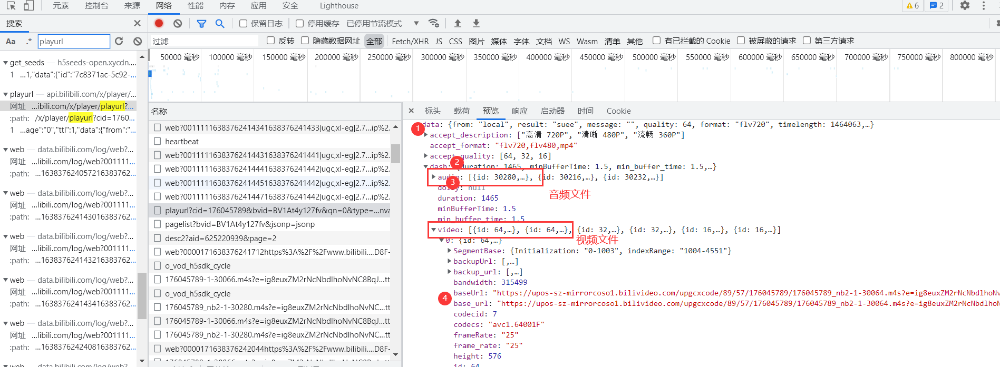

# 观看《中华小子》的新方式

## 视频获取

在bilibili上可以回顾童年动画片《中华小子》，链接`https://www.bilibili.com/video/BV1At4y127fv`

通过搜寻查找到了选集的json数据，根据其参数进行request请求


根据其结构，是嵌套的字典，通过字典的键取值，如下部分是选集采集部分，并将name,page，cid存入各自的列表中。

```python
def get_pname(bvid):
    url = 'https://api.bilibili.com/x/player/pagelist?'
    param={
        'bvid':bvid,
        'jsonp':'jsonp'
    }
    response = requests.get(url=url,params=param,headers=headers).json()
    plist = response['data']
    for p in plist:
        cids.append(p['cid'])
        pages.append(p['page'])
        names.append(p['part'])
```

### 音视频链接搜寻

由下图此我们可以看出，想要获取视频链接就要先得到bvid,cid,session三个值，以及一些其他参数。cid、bvid已经获得，session则在视频html页面中直接存在，通过正则表达式即可获取`session = re.findall('"session":"(.*?)"',response.text)[0]`


真正的视频链接如下



由此判断需要先对palyurl的返回json解析，解析出多个音视频文件，再分别保存为二进制文件,此时获得的音视频是两个单独的文件，可以欣赏纯音乐或者默剧，下一步是合并音视频

### 音视频合并

得到的音视频文件还需要合并才能成为一个完整的视频，否则手动对齐有点困难，这里使用的是`ffmpeg`,下载链接`https://github.com/BtbN/FFmpeg-Builds/releases`，下载后解压，将其下的bin目录添加到系统环境变量path中，可以在cmd中输入`ffmpeg -version`来检查是否添加成功，这样当我们使用命令时系统便可以识别`ffmpeg`并执行命令。

进行合并时，可以在本路径打开cmd输入命令合并

```bash
./ffmpeg.exe -i 【01】【黑狐王归来】.mp4 -i 【01】【黑狐王归来】.mp3 -acodec copy -vcodec copy a【01】【黑狐王归来】.mp4
```

但既然我们已经使用了python，就贯彻到底，导包`subprocess`，调用cmd命令

```python
commandd = f"ffmpeg.exe -i {name}.mp4 -i {name}.mp3 -acodec copy -vcodec copy A{name}.mp4"
subprocess.run(commandd, shell=True)
```

### 完整的程序

```python
import re
import subprocess
import requests

headers = {
    # 浏览器标识符
    'user-agent': 'Mozilla/5.0 (Windows NT 10.0; Win64; x64) AppleWebKit/537.36 (KHTML, like Gecko) '
                  'Chrome/96.0.4664.45 Safari/537.36',
    # 防盗链
    'referer': 'https://www.bilibili.com/video/'
}


def get_response(url):
    """发送请求"""
    response = requests.get(url=url, headers=headers)
    return response


def get_pname(bvid):
    url = 'https://api.bilibili.com/x/player/pagelist?'
    param = {
        'bvid': bvid,
        'jsonp': 'jsonp'
    }
    response = requests.get(url=url, params=param, headers=headers).json()
    plist = response['data']
    for p in plist:
        cids.append(p['cid'])
        pages.append(p['page'])
        names.append(p['part'])
    print("选集列表已得到")


def get_session(bvid, page):
    """request请求后 正则表达式session"""
    url = f'https://www.bilibili.com/video/{bvid}?p={page}'
    response = requests.get(url=url, headers=headers)
    # 使用正则表达式进行获取
    session = re.findall('"session":"(.*?)"', response.text)[0]
    return session


def get_video_url(bvid, cid, session):
    url = 'https://api.bilibili.com/x/player/playurl'
    params = {
        'cid': cid,
        'bvid': bvid,
        'qn': '0',
        'type': '',
        'otype': 'json',
        'fourk': '1',
        'fnver': '0',
        'fnval': '976',
        'session': session
    }
    response = requests.get(url=url, params=params, headers=headers).json()
    # json解析，五层字典取出实际url
    audio_url = response['data']['dash']['audio'][0]['baseUrl']
    video_url = response['data']['dash']['video'][0]['baseUrl']
    print("音视频链接已得到")
    return [audio_url, video_url]


def save_video(name, audio_url, video_url):
    """保存数据 r.content获取二进制内容"""
    # 请求音频数据，返回的数据二进制形式解析
    audio_content = get_response(audio_url).content
    print("开始下载" + name + "音频")
    # 保存音频文件
    with open(f"{name}.mp3", mode='wb') as af:
        af.write(audio_content)
        print(name + "音频保存完成")

    # 请求视频数据，返回的数据二进制形式解析
    video_content = get_response(video_url).content
    print("开始下载" + name + "视频")
    # 保存视频文件
    with open(f"{name}.mp4", mode='wb') as vf:
        vf.write(video_content)
        print(name + "视频保存完成")


def merge_audio_video(name):
    """音视频合并"""
    # cmd 命令
    command = f"ffmpeg.exe -i {name}.mp4 -i {name}.mp3 -acodec copy -vcodec copy A{name}.mp4"
    subprocess.run(command, shell=True)
    print(name + "视频正在执行合成命令")


if __name__ == '__main__':
    bvid = 'BV1At4y127fv'
    # 创建三个列表，存储数据
    cids = []
    pages = []
    names = []
    # 调用选集获取函数，信息填入三个列表
    get_pname(bvid)
    print(cids, pages, names)
    #
    # for p in range(0, len(pages)): #获取所有的选集
    for p in range(0, 1):  # 仅下载第一集， 测试使用
        session = get_session(bvid, pages[p])
        # 通过前文搜集到信息，寻找音视频真正的链接
        vc = get_video_url(bvid, cids[p], session)
        # 根据音频，视频链接分别下载
        save_video(names[p], vc[0], vc[1])
        # 使用ffmpeg.exe合并下载到的音视频
        merge_audio_video(names[p])
```


## 豆瓣影评获取

分为发送请求与页面解析两部分，建表使用Workbook。由于

#### 链接分析

```html
https://movie.douban.com/subject/2244765/comments?start=20&limit=20&status=P&sort=new_score
https://movie.douban.com/subject/2244765/comments?start=40&limit=20&status=P&sort=new_score
```

通过链接的对比我们发现其内容随着链接变化而变化，四个参数limit为一页加载条数，start类似于索引，本业评论首地址，剩余两个参数没有变化。可以通过修改start参数值实现翻页

#### 页面解析

页面中有关信息评论的信息直接加载了出来，我们通过正则表达式即可实现匹配提取

```html
<span class="comment-info">
                <a href="https://www.douban.com/people/96390757/" class="">沧海鲸歌</a>
                    <span>看过</span>
                    <span class="allstar50 rating" title="力荐"></span>
                <span class="comment-time " title="2014-10-17 12:33:03">
                    2014-10-17
                </span>
            </span>

                <span class="short">童年最爱的动画之一，再无下文一直是心中的痛。</span>
```

```python
#评论内容 惰性匹配任意字符
'<span class="short">(.*?)</span>'
# 评论时间 匹配 \s空格 \d数字 -日期间隔
'<span class="comment-time " title=".*?">([\s\d-]*)</span>'
# 评论星级，匹配出数字
stars = re.findall('<span class="allstar(\d+) rating" title=".*?"></span>', text)
```

返回的将会是一个列表，不出意外将是一个20元素的列表，即使出意外也可以使用异常处理在一条出错时不影响其它评论。

### 完整程序

```python
import time

import requests
import re
from openpyxl import Workbook


def get_response(page):
    url = f'https://movie.douban.com/subject/{id}/comments?'
    print(url)
    header = {
        'User-Agent': 'Mozilla/5.0 (Windows NT 6.2; Win64; x64) AppleWebKit/537.36 (KHTML, like Gecko) '
                      'Chrome/96.0.4664.45 Safari/537.36',
        'Cookie': ' '
    }
    param = {
        'start': page * 20,
        'limit': 20,
        'status': 'P',
        'sort': 'new_score'
    }
    response = requests.get(url, params=param, headers=header)
    print(f"正在进行第{page + 1}页评论获取{response.url}")
    return response.text


def get_comments(text):
    """使用正则表达式匹配并写入文件"""

    # 正则表达式匹配出评论 惰性匹配任意字符
    comments = re.findall('<span class="short">(.*?)</span>', text)
    # 评论时间 匹配 \s空格 \d数字 -日期间隔
    times = re.findall('<span class="comment-time " title=".*?">([\s\d-]*)</span>', text)
    # 评论打分
    stars = re.findall('<span class="allstar(\d+) rating" title=".*?"></span>', text)
    print("正则表达式匹配阶段")
    # print(times, stars, comments) # 测试时查看正则表达式匹配结果

    # 使用enumerate函数同时实现索引与内容处理
    for i, comment in enumerate(comments):
        # 使用异常处理在一条出错时不影响其他条
        try:
            # 评论内容原样输出 时间去除换行与空格，星级只取第一个数字50->5
            time = times[i].replace("\n", "").replace(" ", "")
            star = stars[i][:-1]
            # 添加第i行数据
            print(time, star, comment)
            ws.append([time, star, comment])
        except IndexError as ie:
            print(f"索引越界：{ie}")


if __name__ == '__main__':
    # 创建Workbook
    wb = Workbook()
    # 创建一个sheet表
    ws = wb.active
    # 设置表头
    ws.append(['时间', '星级', '评论'])
    col1 = ws.column_dimensions['A']  # 将时间列拓宽
    col1.width = 20
    col3 = ws.column_dimensions['C']  # 将评论列拓宽
    col3.width = 150

    # 中华小子的 id 号
    id = 2244765
    # 获取多少页的评论,一页20条
    pages = 20
    try:
        # 循环发送请求、匹配评论并保存到文件
        for i in range(pages):
            text = get_response(i)
            get_comments(text)
            print(f"写入第{i + 1}页评论")
            # 等待3秒，模拟人的翻页
            time.sleep(3)
    except Exception as e:
        print(f"出现异常:{e}")
    finally:
        # 无论成功与否都会保存文件
        wb.save('中华小子评论.xlsx')
```

### 运行时截图

可见try-except实现了出错不影响整体的效果


## 豆瓣影评分析

通过程序获取豆瓣的评论，共计获取了20页，由于部分评论出错导致本页面其它评论也无法获取，共计365条数据


```python
import numpy as np
import pandas as pd
import matplotlib.pyplot as plt
```


```python
# 读入评论数据 并分行
df = pd.read_excel("中华小子评论.xlsx")
df.columns = ['时间', '星级', '评论']
df
```

<table border="1" class="dataframe">
  <thead>
    <tr style="text-align: right;">
      <th></th>
      <th>时间</th>
      <th>星级</th>
      <th>评论</th>
    </tr>
  </thead>
  <tbody>
    <tr>
      <th>0</th>
      <td>2014-10-17</td>
      <td>5</td>
      <td>童年最爱的动画之一，再无下文一直是心中的痛。</td>
    </tr>
    <tr>
      <th>1</th>
      <td>2013-05-31</td>
      <td>5</td>
      <td>合拍片。用中国元素打造中国魔幻，这是国产应该有的姿态！</td>
    </tr>
    <tr>
      <th>2</th>
      <td>2015-03-22</td>
      <td>4</td>
      <td>曾经让我觉得中国动漫还有希望的动画片</td>
    </tr>
    <tr>
      <th>3</th>
      <td>2016-06-08</td>
      <td>4</td>
      <td>制作在当时堪称精良，虽然被腰斩，但因借鉴火影的单元剧模式，在结构上还是相对完整，值得回味。P...</td>
    </tr>
    <tr>
      <th>4</th>
      <td>2016-02-13</td>
      <td>5</td>
      <td>我当年差点没因为这个出家我会乱说？！</td>
    </tr>
    <tr>
      <th>...</th>
      <td>...</td>
      <td>...</td>
      <td>...</td>
    </tr>
    <tr>
      <th>360</th>
      <td>2017-08-27</td>
      <td>4</td>
      <td>跟同事聊起国产动画，翻出来看，06年的现在看除了打斗场面有些不流畅以外，可以说是制作精良，画...</td>
    </tr>
    <tr>
      <th>361</th>
      <td>2020-04-17</td>
      <td>5</td>
      <td>很好看，不过当年没看完，，，，才知道这部动画没有结局</td>
    </tr>
    <tr>
      <th>362</th>
      <td>2019-07-27</td>
      <td>5</td>
      <td>小时候就有印象的，电视放了好几次，但我其实没有太喜欢</td>
    </tr>
    <tr>
      <th>363</th>
      <td>2020-08-24</td>
      <td>5</td>
      <td>我记得挖了坑没有填 anyway 特别cult 小学放学很晚 动画城看不到 只能晚上守着少儿...</td>
    </tr>
    <tr>
      <th>364</th>
      <td>2018-08-02</td>
      <td>5</td>
      <td>小兰真男主！</td>
    </tr>
  </tbody>
</table>
<p>365 rows × 3 columns</p>


### 星级统计
文档中共计365条星级数据,由于星级恰好是1~5的数字，通过可以计算列表各元素之和再平均得出评分，再统计各星级出现次数时，创建一个列表，索引为星级-1，如果星级为多少就在列表对应位置加1


```python
# 总分数
sum_star = 0
# 各分数次数，依照索引依次为1,2,3,4,5
star_list = [0,0,0,0,0]
for star in df['星级']:
    sum_star += star
    index = star-1
    star_list[index] += 1
```


```python
# 星级评分保留两位小数
average_star = round(sum_star/len(df['星级']),2)
#设置中文显示
plt.rcParams['font.sans-serif']='SimHei'
# 设置画布，画出正圆
plt.figure(figsize=(6,6))
#定义饼图的标签，标签是列表
label=['一星','二星','三星','四星','五星']
# 仅四星级向外扩大
explode=[0,0,0,0.1,0]
colors = ['blue','fuchsia','lightcoral','azure','peachpuff']
plt.pie(star_list,explode=explode,labels=label,colors=colors,autopct='%1.1f%%')#绘制饼图
plt.title(f'中华小子星级分布 平均分{average_star}')
plt.show()
```


    


### 年度评论量
在获取的365条评论中，通过分析评论时间，可以反映出其热度，由于其评论排序与时间也有关，收集的365调数据大多是近几年


```python
# 为了使分月时，第二列显示出数量重新分列，
df.columns = ['时间','数量',' ']
# 将数据类型转换为日期类型
df['时间'] = pd.to_datetime(df['时间'])
# 将date设置为index
df_time = df.set_index('时间')
# 依照年份分离数据 共统计出了 2009到2021的数据
df_month = df_time.resample('Y').sum().to_period('Y')

# make data
x = [i for i in range(2009,2022)]
y = df_month['数量']

# plot
fig, ax = plt.subplots()
ax.stem(x, y)
ax.set(xlim=(2008, 2022), xticks=np.arange(2009, 2021))
ax.set_title("近年份评论量")
ax.set_xlabel("年份")
ax.set_ylabel("评论量")
plt.show()
```


    


### 月度评论量
通过对年度评论量大的近三年数据进行分析，我们可以发现评论量在每年的3月和8月激增，这也与寒暑假相对应


```python
# 为了使分月时，第二列显示出数量重新分列，
df.columns = ['时间','数量',' ']
# 将数据类型转换为日期类型
df['时间'] = pd.to_datetime(df['时间'])
# 将date设置为index
df_time = df.set_index('时间')
# 依照月份份分离数据 共统计出了 2009到2021的数据
df_month = df_time.resample('M').sum().to_period('M')
# 仅提取2019-2022的月份数据
df_month = df_month[-36:]

# make data
mouth_list = []
for y in range(2019,2022):
    for m in range(1,13):
        mouth_list.append(f"{y}-{m}")

# plot
fig, ax = plt.subplots(figsize=(14,5))
ax.plot(mouth_list,df_month['数量'], linewidth=2.0)
plt.xticks(rotation=30)
ax.set_xlabel("月份")
ax.set_ylabel("评论量")
plt.show()
```


    


### 句子云图


```python
#导包
import wordcloud
# 重新分列
df.columns = ['时间', '星级', '评论']
sentence_sum = ''

# 遍历评论
for comment in df['评论']:
    # print(comment)
    sentence_sum = sentence_sum + ' ' + comment
font = r'C:\Windows\Fonts\simfang.ttf'
w = wordcloud.WordCloud(
    font_path=font,
    background_color='white',
    width=3840,
    height=2160,
)
w.generate(sentence_sum)
w.to_file('中华小子句云图.png')
```


### 评论关键词云图


```python
# 导入jieba分词包
import jieba
#  存放解析出的关键词
keywords = []
# 过滤器，去除其中的词
filter=['画片','但是','真的','虽然','时候','现在','还是','一个','小时','觉得']
for comment in df['评论']:
    # jieba 切开句子
    word_list = jieba.lcut_for_search(comment)
    # 列表推导式去除单个字符的干扰项
    word_list = [i for i in word_list if (len(i)>1 and i not in filter)]
    # 过滤后的列表加在一起
    keywords +=word_list

font = r'C:\Windows\Fonts\simfang.ttf'
w = wordcloud.WordCloud(
    font_path=font,
    background_color='white',
    width=3840,
    height=2160,
)
# 列表最终加载成字符串
w.generate(" ".join(keywords))
w.to_file('中华小子词云图.png')
```


