# 美团奶茶店数据分析

## 需求分析

### 引言

当我们想点外卖的时候，往往不由自主的优先选择外卖平台优先推荐的店铺，但也因此时长踩坑。在进行看三个月的Python学习后，我们尝试对外卖平台的数据进行下载解析，自己进行数据分析，并为以后的选择提供参考

### 实现方式

首先是要获取数据，访问美团的网站并对页面进行检查调试，发现美团网站使用的是动态数据加载，数据加载时浏览器上方显示的网址并为发生改变，且在实践中发现第一页没有数据，到了第二页才开始有数据，进行字典解析，并保存到文件中

接下来是对数据进行分析，使用`numpy`,`pandas`对文件数据进行读取解析，并使用`matlibplot`进行可视化呈现。

## 商店海选

### 商店数据获取

打开美团官网，发现网址并未随着页面变化而变化，经过仔细搜寻仍未发现json数据，感到第一页数据是随着页面一起送达，直接融合在HTML文件中。于是打开第二页寻找，果然发现了整齐划一的数据，并得到了数据请求网址。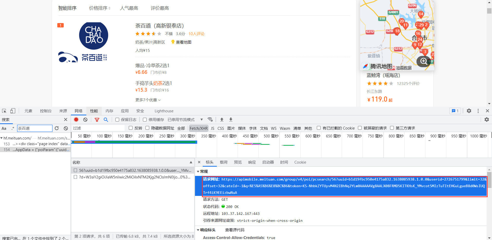

在这个页面中，有整齐的数据，

这些字典格式规整、数据完整，由列表与字典层层嵌套而成。数据格式如下

```python
{code: "0", data: {totalCount: 150, template: "pcfood",…}}
code: "0"
    data: {totalCount: 150, template: "pcfood",…}

        cardExtension: {}
        extraInfoCinema: null
        recommendResult: []
        searchResult: [{id: 682214201, template: "pcfood",…}, {id: 2636210, template: "pcfood",…},…]
            0: {id: 682214201, template: "pcfood",…}
            ···
            areaname: "高新区"
            avgprice: 15
            avgscore: 3.6
            backCateName: "奶茶/果汁"
            id: 682214201
            imageUrl: "http://p0.meituan.net/w.h/biztone/b8df853928aacac04c8add55075cb030325791.jpg"
            latitude: 31.8328
            longitude: 117.1324
            lowestprice: 6.66
			···
            showType: "food"
            tag: []
            template: "pcfood"
            title: "茶百道（高新银泰店）"
```

至此我们找到了解析的方式，使用requests发送请求获取数据，之后使用字典列表对数据进行解析，处理过程中发现这就是大名鼎鼎的json

`https://apimobile.meituan.com/group/v4/poi/pcsearch/56?uuid= &userid= &limit=32&offset=32&cateId=-1&q=%E5%A5%B6%E8%8C%B6&token= `在这个网址中，位于？之后的都是参数。可以放在param字典中待请求时自动处理

这里在编写参数字典时可以使用我们学的正则表达式，`(.*?):(.*)`、`'$1':'$2',`直接实现替换，该方法能将冒号：两边的字符串都加上引号并在最后加上逗号

本程序的流程图如下


源代码如下

```python
import csv
import requests


def requestData(q):
    url = 'https://apimobile.meituan.com/group/v4/poi/pcsearch/56?'
    # userid为自己的用户名
    # limit为请求的数据条数  
    # offset 偏移量
    # q 为搜索项 
    param = {
        'uuid': '',
        'userid': '',
        'limit': '50',
        'offset': '50',
        'cateId': '-1',
        'q': q,
        'token': '',
    }
    # User-Agent:表示浏览器基本信息
    # Cookie: 用户信息，检测是否有登陆账号
    # Referer: 防盗链，从哪里跳转过来的请求url
    header = {
        'User-Agent': 'Mozilla/5.0 (Windows NT 10.0; Win64; x64) AppleWebKit/537.36 (KHTML, like Gecko) Chrome/96.0.4664.45 Safari/537.36',
        'Cookie': '',
        'Referer': 'https://hf.meituan.com/',
    }
    try:
        # 将参数、表头加载后发送请求
        response = requests.get(url=url, params=param, headers=header)
        # 反馈的数据进行json格式解析
        data_json = response.json()
        # pprint.pprint(datajson) # 标准格式打印 使用时需要import pprint
        return data_json
    except Exception as e:
        print("requests请求失败" + str(e))


def parseData(data):
    """对得到的json数据进行解析"""
    # 根据此前对数据的分析结果，searchResult值 位于data字典中，是一个列表形式数据
    searchResult = data['data']['searchResult']
    with open("{}.csv".format(q), mode="a", encoding='utf-8', newline="") as f:
        csvpencil = csv.DictWriter(f, fieldnames=['店铺名', '店铺所在位置', '人均消费', '评分', '美食名称', '店铺图片链接',
                                                  '纬度', '经度', '最低价格', '店铺ID', '店铺详情页'])
        csvpencil.writeheader()  # 写入表头
        try:
            # 对searchResult列表进行索引解析，其内容是以字典形式存放，我们提取时也以字典存储
            for item in searchResult:
                data_dict = {
                    '店铺名': item['title'],
                    '店铺所在位置': item['areaname'],
                    '人均消费': item['avgprice'],
                    '评分': item['avgscore'],
                    '美食名称': item['backCateName'],
                    '店铺图片链接': item['imageUrl'],
                    '纬度': item['latitude'],
                    '经度': item['longitude'],
                    '最低价格': item['lowestprice'],
                    '店铺ID': item['id'],
                    '店铺详情页': f'https://www.meituan.com/meishi/{item["id"]}/'
                }
                csvpencil.writerow(data_dict)
        except Exception as e:
            print("数据解析失败" + str(e))


if __name__ == '__main__':
    q = "奶茶"
    parseData(requestData(q))
```

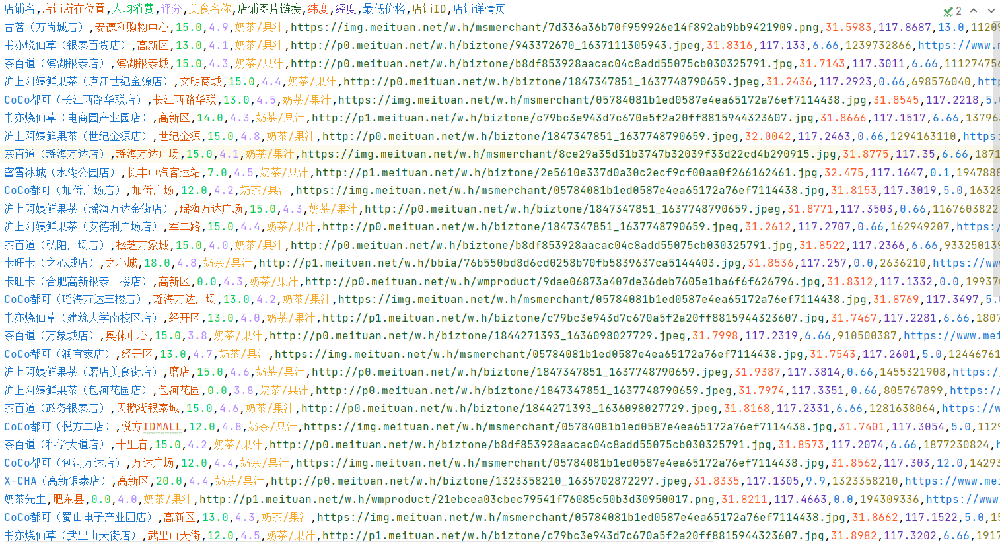

我们获得了288条数据数据，接下来是对数据进行分析

### 商店数据分析

#### 相关模块导入

```python
import numpy as np
import pandas as pd
import matplotlib.pyplot as plt

plt.rcParams['font.family'] = ['STFangsong']  # 指定默认字体 仿宋
```

#### 文件数据读入

使用pandas读取信息并按列分开

```python
df = pd.read_csv('奶茶.csv')
df.columns = ['店铺名', '店铺所在位置', '人均消费', '评分', '美食名称', '店铺图片链接',
              '纬度', '经度', '最低价格', '店铺ID', '店铺详情页']
print(df.shape[0]) #288
```

#### 数据去重

Pandas提供了去重函数：drop_duplicates()

subset：默认为None去除重复项时要考虑的标签，当subset=None时所有标签都相同才认为是重复项；

keep：有三个可选参数，分别是 first、last、False，默认为 first，表示只保留第一次出现的重复项；

inplace：布尔值参数，默认为 False 表示删除重复项后返回一个副本，若为 Ture 则表示直接在原数据上删除重复项。

```python
df.drop_duplicates(subset=None, keep='first', inplace=True)
print(df.shape[0]) #284
```

#### 价格与评分线性回归分析图

通过画出人均价格与评分之间的关系，我们可以清楚的观察到是否越贵的东西越好,同时也可以引入最低价格，从另一个方面观察它们之间的关系

线性回归分析图我们发现价格8-12的评分集中于高点，其它价格评分比较分散，线性方程计算而出的结果也显示价格高的奶茶评分较高；
而最低价格与评分关系并不大，线性方程也表明两者几乎无关。

```python
import seaborn as sns

# make data
fig, axes = plt.subplots(2, 1, figsize=(12, 12))
sns.regplot(x='人均消费', y='评分', data=df, color='red', marker='+', ax=axes[0])
sns.regplot(x='最低价格', y='评分', data=df, color='green', marker='*', ax=axes[1])
plt.show()
```

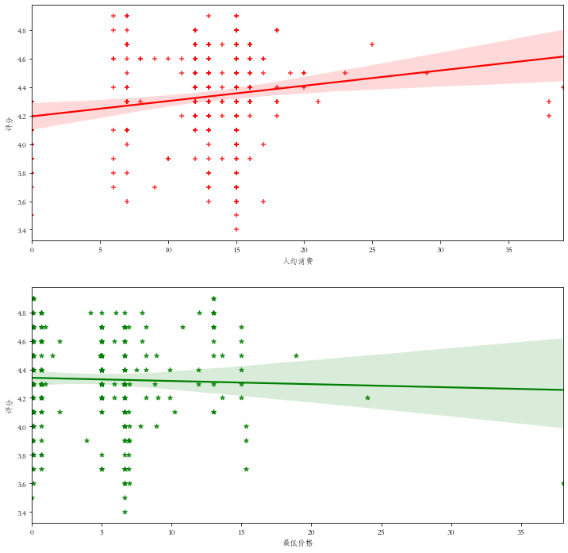

#### 品牌统计

品牌可以从商店名中截取出来，使用集合、列表分别存储，成为之后的键值对。我们计算出各品牌出现次数并从高到低排序，再使用柱状图可视化呈现

##### 列表转字典函数

以集合的形式输入键，通过对传入的列表统计计算出值

```python
def countDict(aSet: set, aList: list, minValue=0) -> dict:
    # 列表转为字典，统计出aSet中每个元素出现的次数
    aDict = {}
    for item in aSet:
        counter = aList.count(item)
        if counter >= minValue:  #去除仅出现一次的品牌，极有可能是商家打错了
            aDict[item] = aList.count(item)

    return aDict
```

```python
# 传入数据
shopNames = df['店铺名']
# 品牌列表，将截取出的品牌名存入列表
brandList = []
# 品牌名使用集合存储，利用集合元素唯一性自动实现去重
brandSet = set()

for shopName in shopNames:
    # 店铺名一般是 “品牌（地址）” 的形式，通过中文符号'（'来截取出品牌
    index = shopName.find('（')  # 返回（的位置，未找到返回-1'
    # 三元表达式 ，如果没有（）就直接原样返回
    brand = shopName[:index] if index != -1 else shopName
    brandSet.add(brand)
    brandList.append(brand)

brandDict = countDict(brandSet, brandList, 2)

# 将字典按照元素值进行逆序排序
brandDict = dict(sorted(brandDict.items(), key=lambda i: i[1], reverse=True))
```

```python
# make data:
x = brandDict.keys()
y = brandDict.values()

# plot
fig = plt.subplots(figsize=(18, 9))
colors = ['tomato', 'aqua', 'bisque', 'lightgreen', 'skyblue']
plt.bar(x, y, width=0.5, color=colors, edgecolor="white", linewidth=0.7)
plt.xlabel('品牌名称')
plt.ylabel('品牌出现次数')
plt.show()
```


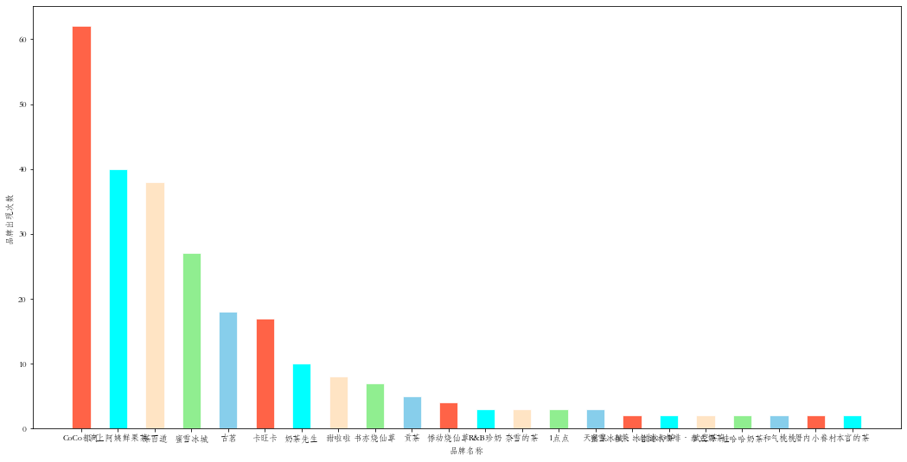

```python
# 精简数据，仅采用出现三次以上的数据
brandDict = countDict(brandSet, brandList, 3)
# Pie chart, where the slices will be ordered and plotted counter-clockwise:
labels = brandDict.keys()
sizes = brandDict.values()
# only "explode" the 4nd slice (i.e. 'Hogs')
explode = [0 for _ in range(len(sizes))]
explode[3] = 0.1
colors = ['tomato', 'aqua', 'bisque', 'lightgreen', 'skyblue']
fig1, ax1 = plt.subplots()
ax1.pie(sizes, explode=explode, labels=labels, autopct='%1.1f%%', colors=colors,
        shadow=True, startangle=0)
ax1.axis('equal')  # Equal aspect ratio ensures that pie is drawn as a circle.
plt.show()
```

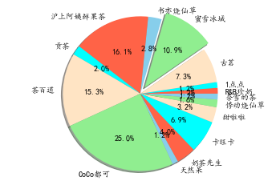

#### 地点统计

店铺名称中通常含有地址，正事中文括号中的部分，我们同样可以通过字符串截取出地址，但由于个别商店格式并非如此，可能会出现未填地址的情况，则会直接跳过

```python
# 传入数据
shopNames = df['店铺名']
# 品牌列表，将截取出的品牌名存入列表
placeList = []
# 品牌名使用集合存储，利用集合元素唯一性自动实现去重
placeSet = set()

for shopName in shopNames:
    # 店铺名一般是 “品牌（地址）” 的形式，通过中文符号'（'来截取出品牌
    index = shopName.find('（')  # 返回（的位置，未找到返回-1'
    if index != -1:
        place = shopName[index + 1:-1]
        placeSet.add(place)
        placeList.append(place)

placeDict = countDict(placeSet, placeList, 2)

# 将字典按照元素值进行逆序排序
placeDict = dict(sorted(placeDict.items(), key=lambda i: i[1], reverse=False))
placeData = pd.DataFrame({'地点': [x for x in placeDict.keys()],
                          '出现次数': [x for x in placeDict.values()]})
```

```python
# make data: 竖行柱状图
x = placeData['地点']
y = placeData['出现次数']

# plot
fig = plt.subplots(figsize=(18, 9))
colors = ['tomato', 'aqua', 'bisque', 'lightgreen', 'skyblue']
plt.barh(x, y, color=colors, edgecolor="white", linewidth=0.7)
plt.xlabel('地点')
plt.ylabel('地点出现次数')
plt.show()
```

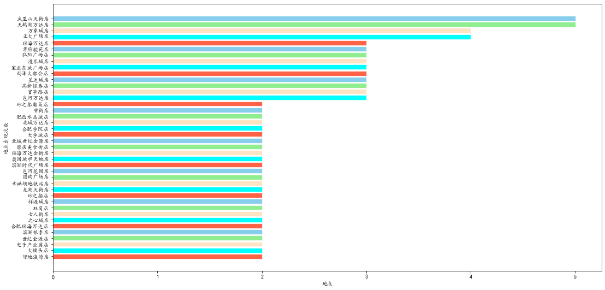

#### 店铺位置模拟

我们获取了近300家店铺的经纬度信息，虽然我们暂时无法直接定位到地图上，但我们可以画出经纬度散点图，来大致推断出哪里奶茶店较多。
合肥所在地区的纬度大约为北纬32°，不同纬度间距相同都是1纬度约110.94，北纬32°处的纬度周长为40075×sin(90-32)，因此此处的1纬度约为94.40
经纬度比例为1.1752。通过计算得出，在画布长宽都代表1.2°时画布设置为20×17时比例1.1764较为接近，误差仅有1.08%
在将我们所在位置带入散点图，即可发现奶茶店大多在我们的东方、北方，这与城市发展状况也较为符合

```python
# make the data
# 获取经纬度信息
longitude = df['经度']
latitude = df['纬度']
# size and color:
sizes = np.random.uniform(15, 80, len(longitude))
colors = np.random.uniform(15, 80, len(latitude))

# plot
fig, ax = plt.subplots(figsize=(20, 17))

ax.scatter(x=longitude, y=latitude, s=sizes, c=colors, vmin=0, vmax=100)

ax.set(xlim=(116.9, 118.1), xticks=np.arange(116.9, 118.1, 0.1),
       ylim=(31.2, 32.4), yticks=np.arange(31.2, 32.4, 0.1))
# 是否显示网格，默认不显示
ax.grid(True)
ax.set_xlabel("东经116.9——118.1")
ax.set_ylabel("北纬31.2——32.4")
plt.show()
```


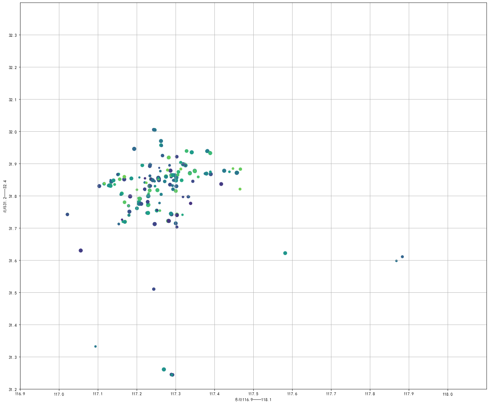

## 商店决赛

经过海选，再结合地理位置，最终选出古茗（蜀山安大店）、沪上阿姨鲜果茶（安大磬苑校区店）、书亦烧仙草（簋街大学城店）、茶百道（大学城店）四家店铺进行详细的评论分析

后期在实践中发现第二个店铺始终无法获取数据，最终发现是这家真的没有评论数据，而第四家也着实没有tags

### 评论获取

经过查找，我们同样找到了数据请求链接，也返现了返回的字典嵌套列表嵌套字典的数据层级，同时我们发现其会返回评论数量，这样我们可以先进行第一次查询，
接着根据返回的total值进行循环，一页10个数据

```json
{status: 0, data: {,…}}
    data: {,…}
        comments: [{userName: "", userUrl: "", avgPrice: 12, comment: "无语住了，就这水平还说，跑来一趟容易吗",…},…]
            0: {userName: "", userUrl: "", avgPrice: 12, comment: "无语住了，就这水平还说，跑来一趟容易吗",…}
            1: {userName: "UhH816306504", userUrl: "", avgPrice: 12,…}
                comment: "此次用餐总体来说不错，觉得比较认可的地方有：性价比、口味、环境、服务、团购接待。"
                menu: "黄金珍珠奶茶1杯"
                star: 50
                ···
            ···
    tags: [{count: 35, tag: "味道赞"}, {count: 32, tag: "环境很好"}, {count: 31, tag: "饮品赞"}, {count: 27, tag: "服务热情"},…]
        0: {count: 35, tag: "味道赞"}
        1: {count: 32, tag: "环境很好"}
        ···
    total: 471
    status: 0
```

#### 代码实现

```python
import pprint
import time
import requests
import csv


def requestCommentTags(id, page):
    url = 'https://www.meituan.com/meishi/api/poi/getMerchantComment?'
    # userid为自己的用户名
    # limit 为一次请求数据，一次10条
    # offset为偏移量，类似于页数
    # id 为店铺id
    param = {
        'uuid': 'f79f1498663140408d8d.1638116128.1.0.0',
        'platform': '1',
        'partner': '126',
        'originUrl': f'https://www.meituan.com/meishi/{id}/',
        'riskLevel': '1',
        'optimusCode': '10',
        'id': id,
        'userId': '2726751799',
        'offset': page * 10,
        'pageSize': '10',
        'sortType': '1',
    }
    # User-Agent:表示浏览器基本信息
    # Cookie: 用户信息，检测是否有登陆账号
    # Referer: 防盗链，从哪里跳转过来的请求url，相当于定位地址
    header = {
        'User-Agent': 'Mozilla/5.0 (Windows NT 10.0; Win64; x64) AppleWebKit/537.36 (KHTML, like Gecko) Chrome/96.0.4664.45 Safari/537.36',
        'Cookie': '',
        'Referer': f'https://www.meituan.com/meishi/{id}/',
    }
    try:
        # 将参数、表头加载后发送请求
        response = requests.get(url=url, params=param, headers=header)
        # 反馈的数据进行json格式解析
        data_json = response.json()
        pprint.pprint(data_json)  # 标准格式打印 使用时需要import pprint
        return data_json
    except Exception as e:
        print("requests请求失败" + str(e))


def parseComment(data):
    """对得到的json数据进行解析，选出评论"""
    try:
        # 根据此前对数据的分析结果，searchResult值 位于data字典中，是一个列表形式数据
        comments = data['data']['comments']
        # 对searchResult列表进行索引解析，其内容是以字典形式存放，我们提取时也以字典存储
        for item in comments:
            comments_dict = {
                '评论内容': item['comment'],
                '购买商品': item['menu'],
                '星级': item['star'],
            }
            # 逐行立刻写入数据，以防出错导致的前功尽弃，同样是依照字典进行
            commentpencil.writerow(comments_dict)
        total = data['data']['total']
        return total
    except Exception as e:
        print("评论数据解析失败" + str(e))


def parseTags(data, shopName):
    """对得到的json数据进行解析，选出评论"""
    try:
        tags = data['data']['tags']
        for tag in tags:
            tags_dict = {
                '店铺': shopName,
                '标签': tag['tag'],
                '数量': tag['count']
            }
            tagpencil.writerow(tags_dict)

    except Exception as e:
        print("标签数据解析失败" + str(e))


if __name__ == '__main__':
    shops = {1088411800: '古茗（蜀山安大店）', 1479103527: '书亦烧仙草（簋街大学城店）', 1616840469: '茶百道（大学城店）'}
    for shopId in shops.keys():
        shopName = shops[shopId]
        with open("{}.csv".format(shopName), mode="a", encoding='utf-8', newline="") as f, open("商店标签信息.csv", mode="a",
                                                                                                encoding='utf-8',
                                                                                                newline="") as tf:
            commentpencil = csv.DictWriter(f, fieldnames=['评论内容', '购买商品', '星级'])
            commentpencil.writeheader()  # 写入表头
            tagpencil = csv.DictWriter(tf, fieldnames=['店铺', '标签', '数量'])
            tagpencil.writeheader()  # 写入表头

            # 进行第一页获取
            jsdata = requestCommentTags(id=shopId, page=0)
            # 得到总评论数
            total = parseComment(jsdata)
            # 解析其tags，一家店铺仅需一次
            parseTags(jsdata, shopName)

            pages = int(total / 10)
            # 进行其他页数获取
            for i in range(1, pages):
                # 暂停三秒，模拟人浏览页面正常翻页
                time.sleep(3)
                parseComment(requestCommentTags(id=shopId, page=i))

```

#### 数据截图

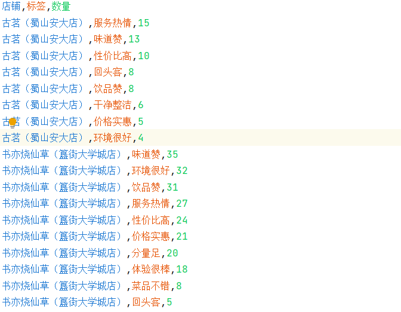

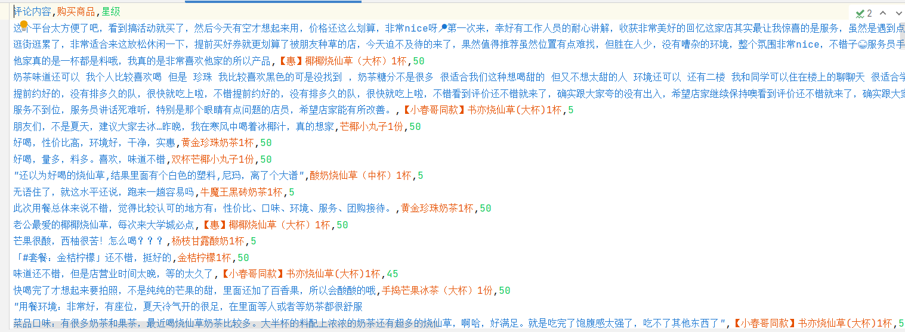

### 评论数据分析

已经获取了三家店铺的评论数据，其中两家又获取了标签，根据大家的评论进行更详细的数据分析,第一步要做的依然是进行导包

```python
import pandas as pd
import matplotlib.pyplot as plt
import wordcloud

plt.rcParams['font.family'] = ['STFangsong']  # 指定默认字体 仿宋
```

#### 评论标签分析

根据两家店铺评论标签的数量进行分析

```python
# 数据读取
df = pd.read_csv('商店标签信息.csv')
df.columns = ['店铺', '标签', '数量']
```

```python
# 数据分离，将两家店铺信息拆开，并绘制饼状图
guming = df[df["店铺"] == '古茗（蜀山安大店）']
shuyi = df[df["店铺"] == '书亦烧仙草（簋街大学城店）']

# Pie chart, where the slices will be ordered and plotted counter-clockwise:
guminglabels = guming['标签']
gumingsizes = guming['数量']
shuyilabels = shuyi['标签']
shuyisizes = shuyi['数量']
colors = ['tomato', 'aqua', 'bisque', 'lightgreen', 'skyblue']

fig, axes = plt.subplots(1, 2, figsize=(12, 6))
axes[0].pie(gumingsizes, colors=colors, labels=guminglabels, autopct='%1.1f%%',
            shadow=True, startangle=90)
axes[0].set_title('古茗（蜀山安大店）')
axes[1].pie(shuyisizes, colors=colors, labels=shuyilabels, autopct='%1.1f%%',
            shadow=True, startangle=90)
axes[1].set_title('书亦烧仙草（簋街大学城店）')
fig.suptitle("店铺评论中标签数量占比")
plt.show()
```


将两家店铺放入同一个折线图中，需要将两个标签合并，选出其中相同的部分，其次由于评论数差异较大，本次使用不同y坐标轴

```python
# 将两个标签转成集合形式再进取并集
labelset = set(guminglabels) & set(shuyilabels)
# 再转为列表从而实现有序，能够迭代
xlabel = list(labelset)
gmlabel = []
sylabel = []
for label in xlabel:
    x = guming[guming["标签"] == label]
    x = list(x['数量'])
    gmlabel.append(x[0])
    x = shuyi[shuyi["标签"] == label]
    x = list(x['数量'])
    sylabel.append(x[0])
```

```python
# 根据求出的三个列表画出分y轴的折线图
from mpl_toolkits.axes_grid1 import host_subplot

host = host_subplot(111)
par = host.twinx()

host.set_xlabel("标签")
host.set_ylabel("古茗（蜀山安大店）")
par.set_ylabel("书亦烧仙草（簋街大学城店）")

p1, = host.plot(xlabel, gmlabel, label="古茗（蜀山安大店）")
p2, = par.plot(xlabel, sylabel, label="书亦烧仙草（簋街大学城店）")

leg = plt.legend()

host.yaxis.get_label().set_color(p1.get_color())
leg.texts[0].set_color(p1.get_color())

par.yaxis.get_label().set_color(p2.get_color())
leg.texts[1].set_color(p2.get_color())

plt.show()
#### 评论内容分析
```


#### 词云图

```python
# 读取三个评论数据文件
gmdf = pd.read_csv('古茗（蜀山安大店）.csv')
gmdf.columns = ['评论内容','购买商品','星级']

sydf = pd.read_csv('书亦烧仙草（簋街大学城店）.csv')
sydf.columns = ['评论内容','购买商品','星级']

cbddf = pd.read_csv('茶百道（大学城店）.csv')
cbddf.columns = ['评论内容','购买商品','星级']
```

```python
import jieba

def makewordscloud(df,name):
    words = []
    stopwords = ['可以','非常','哈哈哈','真的']
    for i,comment in enumerate(df['评论内容']):
        if pd.isnull(df.at[i,'评论内容'])==False:
            comment.replace("\n",'')
            wordlist = jieba.cut(comment)
            for word in wordlist:
                if len(word)>1 and word not in stopwords:
                    words.append(word)

    font = r'C:\Windows\Fonts\simfang.ttf'
    w = wordcloud.WordCloud(
        font_path=font,
        background_color='white',
        width=3840,
        height=2160,
    )
    w.generate(' '.join(words))
    w.to_file(f'{name}.png')

# 三个店铺的词云图
# makewordscloud(gmdf,'古茗词云图')
makewordscloud(sydf,'书亦烧仙草词云图')
#makewordscloud(cbddf,'茶百道词云图')
```

- 茶百道词云图

  - 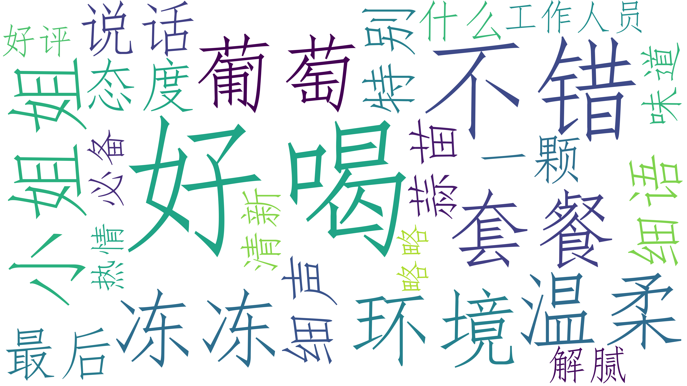
- 古茗词云图

  - 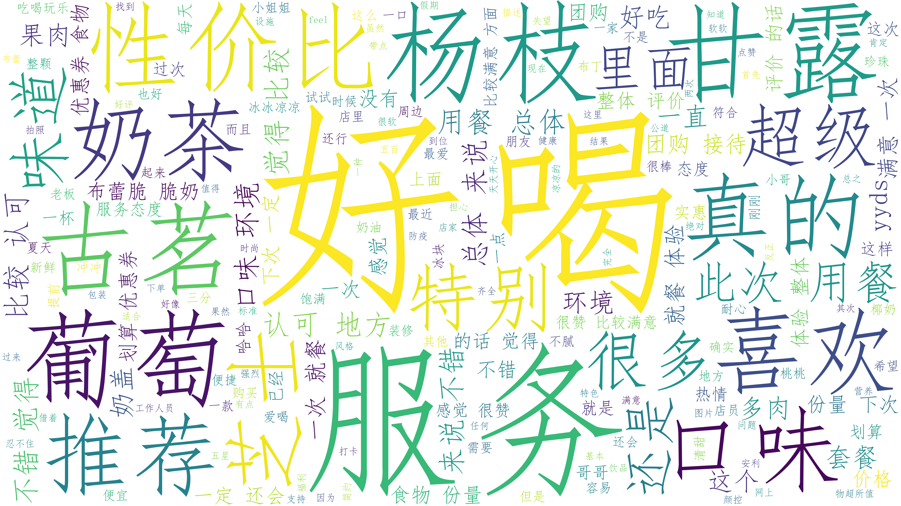
- 书亦烧仙草词云图

  - 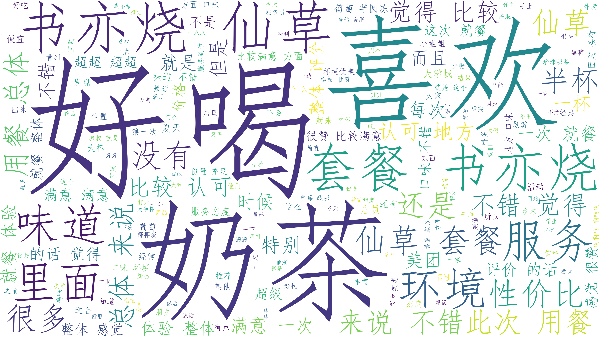

#### 评分分布

由于茶百道数据过少，只有十几条，我们接下来只使用 书亦烧仙草、古茗 两份数据

##### 列表转字典函数

以集合的形式输入键，通过对传入的列表统计计算出值，与上文中相同

```python
def countDict(aSet: set, aList: list, minValue=0) -> dict:
    # 列表转为字典，统计出aSet中每个元素出现的次数
    aDict = {}
    for item in aSet:
        counter = aList.count(item)
        if counter >= minValue:  #去除仅出现一次的品牌，极有可能是商家打错了
            aDict[item] = aList.count(item)

    return aDict
```

##### DataFrame转字典函数

先生成列表，再借用列表转字典函数

```python
import math

def dfToDict(df,minValue=2):
    # 传入数据
    milkTeaNames = df['购买商品']
    # 品牌列表，将截取出的品牌名存入列表
    milkTeaList = []
    # 品牌名使用集合存储，利用集合元素唯一性自动实现去重
    milkTeaSet = set()

    for milkTeaName in milkTeaNames:
        milkTeaSet.add(milkTeaName)
        milkTeaList.append(milkTeaName)

    milkTeaDict = countDict(milkTeaSet, milkTeaList, minValue)

    # 将字典按照元素值进行逆序排序
    milkTeaDict = dict(sorted(milkTeaDict.items(), key=lambda i: i[1], reverse=True))
    return milkTeaDict
```

```python
# make data:
gmDict = dfToDict(gmdf)
x1 = gmDict.keys()
y1 = gmDict.values()

syDict = dfToDict(sydf,8)

x2 = syDict.keys()
y2 = syDict.values()


# plot
fig,axes= plt.subplots(1,2,figsize=(18, 9))
colors = ['tomato', 'aqua', 'bisque', 'lightgreen', 'skyblue']
axes[0].bar(x1, y1, width=0.3, color=colors, edgecolor="white", linewidth=0.5)

axes[1].bar(x2, y2, width=0.3, color=colors, edgecolor="white", linewidth=0.4)
plt.xticks(rotation=90)
plt.xlabel('奶茶名称')
plt.ylabel('奶茶出现次数')
plt.show()

```


