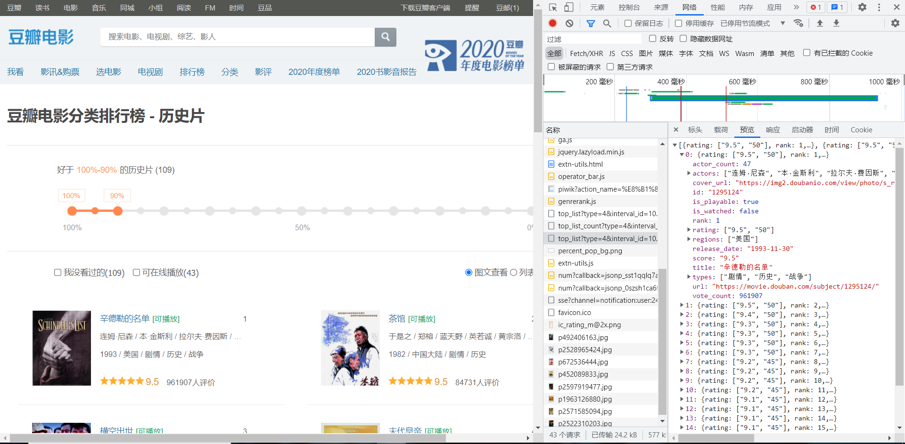
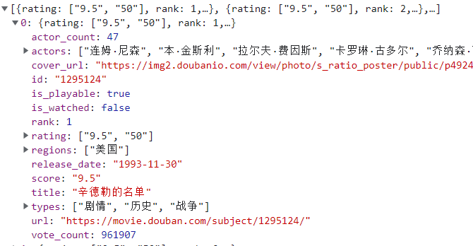

# 豆瓣电影排行榜

打开豆瓣的电影排行榜，随机找一个分类，随后对页面进行分析，经过查到，找到了信息请求的链接`https://movie.douban.com/j/chart/top_list?type=4&interval_id=100%3A90&action=&start=0&limit=20`，返回的是一个json数据，



根据请求链接，我们发现url所带的参数有四个type为分类 start获得元素起始点，相当于页数 limit限制，相当于获取元素终点，'interval_id'、'action'意义不明

```python

    param = {
        'type': 4,
        'interval_id': '100:90',
        'action': '',
        'start': 0,
        'limit': 20
    }
```

由于其返回的是json数据，因此使用jsonu接收方式，最中数据下载函数如下：

```

def getdata():
    # 指定url 请求网址: https://movie.douban.com/j/chart/top_list?type=4&interval_id=100%3A90&action=&start=0&limit=1
    post_url = 'https://movie.douban.com/j/chart/top_list'
    # UA伪装
    headers = {
        "User-Agent": "Mozilla/5.0 (Windows NT 10.0; Win64; x64) AppleWebKit/537.36 (KHTML, like Gecko) Chrome/96.0.4664.45 Safari/537.36 Edg/96.0.1054.29"
    }
    # 处理url所带的参数，封装到字典 type类型 4为历史 start获得元素起始点 limit限制，相当于获取元素终点
    param = {
        'type': 4,
        'interval_id': '100:90',
        'action': '',
        'start': 0,
        'limit': 20
    }
    # 发起请求，带3参数
    r = requests.get(url=post_url, params=param, headers=headers)
    print(r.url)
    # 获取相应json格式数据
    lidata = r.json()
    print(lidata)
    # 数据存储
    with open('douban.json', 'w', encoding='utf-8') as f:
        json.dump(lidata, fp=f, ensure_ascii=False)
    return lidata
```

根据json的结构，进行如下分析



经过分析我们解析json字典

```python
film_dict = {
            '电影名': item['title'],
            '评分': item['score'],
            '发布日期':item['release_date'],
            '地区':item['regions'],
            '类型': item['types'],
            '投票数':item['vote_count'],
            '演员数':item['actor_count'],
            '演员':item['actors']
        }
```

随后写入表格中

```python
def download(data):
    for item in data:
        film_dict = {
            '电影名': item['title'],
            '评分': item['score'],
            '发布日期':item['release_date'],
            '地区':item['regions'],
            '类型': item['types'],
            '投票数':item['vote_count'],
            '演员数':item['actor_count'],
            '演员':item['actors']
        }
        fp.writerow(film_dict)
```

| 电影名               | 评分 | 发布日期   | 地区                                   | 类型                             | 投票数 | 演员数 | 演员                                                         |
| -------------------- | ---- | ---------- | -------------------------------------- | -------------------------------- | ------ | ------ | ------------------------------------------------------------ |
| 辛德勒的名单         | 9.5  | 1993/11/30 | ['美国']                               | ['剧情', '历史', '战争']         | 961918 | 47     | ['连姆·尼森', '本·金斯利', '拉尔夫·费因斯', '卡罗琳·古多尔', '乔纳森·萨加尔', '艾伯丝·戴维兹', '马尔戈萨·格贝尔', '马克·伊瓦涅', '碧翠斯·马科拉', '安德烈·瑟韦林', '弗里德里希·冯·图恩', '克齐斯茨托夫·拉夫特', '诺伯特·魏塞尔', '维斯瓦夫·科马萨', '皮奥特·赛尔沃斯', 'Tadeusz Huk', '马丁·塞梅洛格', '托马斯·德德克', '奥拉夫·卢巴申科', '马瑞安·格林卡', '约亨·尼克尔', '艾尔文·莱德', 'Maciej Orlos', '吴俊全', '佐久间玲', '约阿希姆·保罗·阿斯波克', '彭河', '戈兹·奥托', '玛雅·奥丝塔泽斯卡', 'Maciej Kozlowski', '阿格尼兹卡·旺格', '阿格涅兹卡·克鲁科沃娜', 'Eugeniusz Priwieziencew', '布兰科·拉斯蒂格', 'Marta Bizon', 'Ezra Dagan', '吉恩·莱赫纳', 'Razia Israeli', '拉米·希尔伯格', '路德格·皮斯特', '埃琳娜·勒文松', '胡契克·卡勒塔', '塔德乌什·布拉德茨基', '亨里克·比斯塔', '帕维·德朗柯', '耶日·诺瓦克', '安娜·穆查'] |
| 茶馆                 | 9.5  | 1982       | ['中国大陆']                           | ['剧情', '历史']                 | 84736  | 36     | ['于是之', '郑榕', '蓝天野', '英若诚', '黄宗洛', '童超', '金昭', '林连昆', '牛星丽', '谭宗尧', '童弟', '吴淑昆', '胡宗温', '程中', '李大千', '李源', '李翔', '张瞳', '任宝贤', '尚丽娟', '米铁增', '田春奎', '冯增祥', '雷飞', '林东升', '孟瑾', '孙峻峰', '平原', '曹世骧', '王大年', '张华', '丁海涛', '朱旭', '孙敬修', '董行佶', '王淑华'] |
| 横空出世             | 9.4  | 1999/12/12 | ['中国大陆']                           | ['剧情', '历史']                 | 56459  | 13     | ['李雪健', '李幼斌', '高明', '陈瑾', '滕汝骏', '张勇手', '刘琳', '陶海', '张国民', '李晓耕', '李胜源', '王星瀚', '王明智'] |
| 末代皇帝             | 9.3  | 1987/10/4  | ['英国', '意大利', '中国大陆', '法国'] | ['剧情', '传记', '历史']         | 725898 | 35     | ['尊龙', '陈冲', '邬君梅', '彼得·奥图尔', '英若诚', '吴涛', '黄自强', '丹尼斯·邓', '坂本龙一', '马吉·汉', '里克·扬', '田川洋行', '苟杰德', '理查德·吴', '皱缇格', '陈凯歌', '卢燕', '区亨利', '陈述', '鲍皓昕', '黄文捷', '邵茹贞', '亨利·基', '张良斌', '梁冬', '康斯坦丁·格雷戈里', '黄汉琪', '王涛', '宋怀桂', '蔡鸿翔', '程淑艳', '张天民', '王彪', '劳力', '户田惠子'] |
| 活着                 | 9.3  | 1994/5/17  | ['中国大陆', '中国香港']               | ['剧情', '历史', '家庭']         | 709758 | 17     | ['葛优', '巩俐', '姜武', '牛犇', '郭涛', '张璐', '倪大红', '肖聪', '董飞', '刘天池', '董立范', '黄宗洛', '刘燕瑾', '李连义', '杨同顺', '苏岩', '王丽华'] |
| 乱世佳人             | 9.3  | 1939/12/15 | ['美国']                               | ['剧情', '历史', '爱情', '战争'] | 600694 | 37     | ['费雯·丽', '克拉克·盖博', '奥利维娅·德哈维兰', '托马斯·米切尔', '芭芭拉·欧内尔', '伊夫林·凯耶斯', '安·卢瑟福德', '乔治·里弗斯', '弗莱德·克莱恩', '海蒂·麦克丹尼尔斯', '奥斯卡·波尔克', '巴特弗莱·麦昆', '维克托·乔里', '埃弗雷特·布朗', '霍华德·C·希克曼', '艾丽西亚·瑞特', '莱斯利·霍华德', '兰德·布鲁克斯', '卡洛尔·奈', '劳拉·霍普·克鲁斯', '埃迪·安德森', '哈里·达文波特', '利昂娜·罗伯特', '简·达威尔', '欧娜·满森', '保罗·赫斯特', '伊莎贝尔·朱尔', '卡米·金·肯伦', '艾瑞克·林登', 'J·M·克里根', '沃德·邦德', '莉莲·肯布尔-库珀', '李守贞', '唐烨', '吴文伦', '查曼若', '彭河'] |
| 永不消逝的电波(舞剧) | 9.3  | 2020/5/14  | ['中国大陆']                           | ['历史', '歌舞']                 | 1266   | 2      | ['朱洁静', '王佳俊']                                         |
| 无言的山丘           | 9.2  | 1992/12/5  | ['中国台湾']                           | ['剧情', '历史']                 | 14731  | 9      | ['杨贵媚', '黄品源', '澎恰恰', '文英', '陈仙梅', '任长彬', '许杰辉', '陆弈静', '陈博正'] |
| 战争与和平           | 9.2  | 1966/3/14  | ['苏联']                               | ['剧情', '历史', '爱情', '战争'] | 9668   | 43     | ['谢尔盖·邦达尔丘克', '柳德米拉·萨维里耶娃', '维亚切斯拉夫·吉洪诺夫', '安娜斯塔西亚·维尔金斯卡娅', '安东宁娜·舒拉诺娃', '鲍里斯·扎哈瓦', '阿纳托利·克托罗夫', '奥列格·塔巴科夫', '维克托·斯坦尼岑', '伊琳娜·斯科布采娃', '瓦西里·兰诺沃依', '琪拉·戈洛夫科', '伊琳娜·古巴诺娃', '亚历山大·费·鲍里索夫', '奥列格·叶甫列莫夫', '朱利·乔霍涅利泽', '弗拉季斯拉夫·斯特尔热利奇克', '安格林娜·斯捷潘诺娃', '尼古拉·特罗菲莫夫', '尼古拉·雷布尼科夫', '爱德华·马尔采维奇', '叶莲娜·佳普金娜', '诺娜·莫尔久科娃', '彼得·萨温', '谢苗·斯瓦申科', '谢尔盖·尼科年科', '丹尼尔·涅特列宾', '阿列克谢·格拉济林', '伊万·热瓦戈', '加琳娜·克拉夫琴科', '尼古拉·格林科', '斯坦尼斯拉夫·切坎', '列夫·波利亚科夫', '杰玛·菲尔索娃', '安德烈·斯米尔诺夫', '亚历山大·斯米尔诺夫', '尼古拉·布勃诺夫', '乔治·米利亚尔', '罗季翁·亚历山德罗夫', '伊娅·阿列比娜', '玛丽亚·卡普尼斯特', '尼古拉·库图佐夫', '尼基塔·米哈尔科夫'] |
|...|...|...|...|...|...|...|...|

